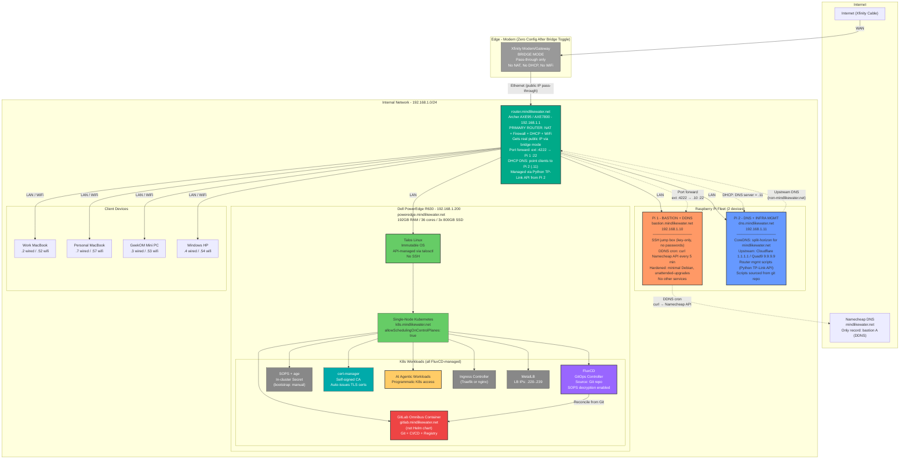
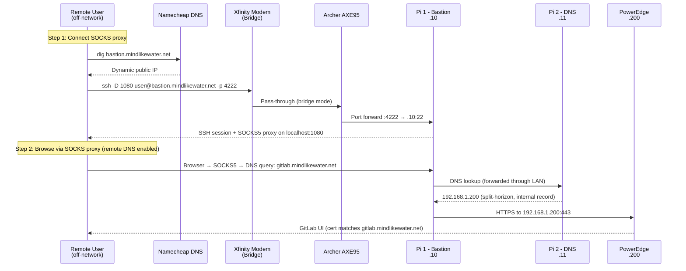
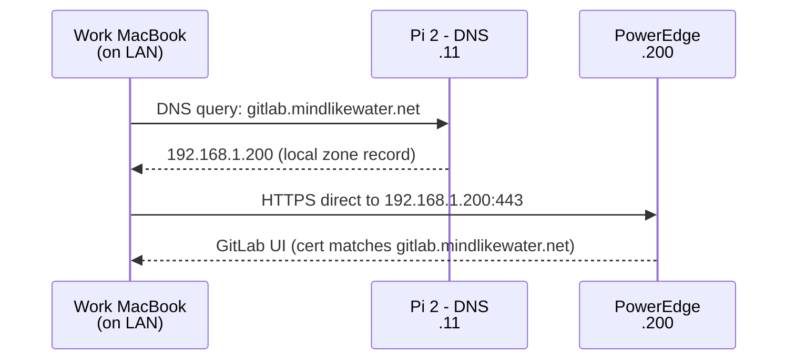
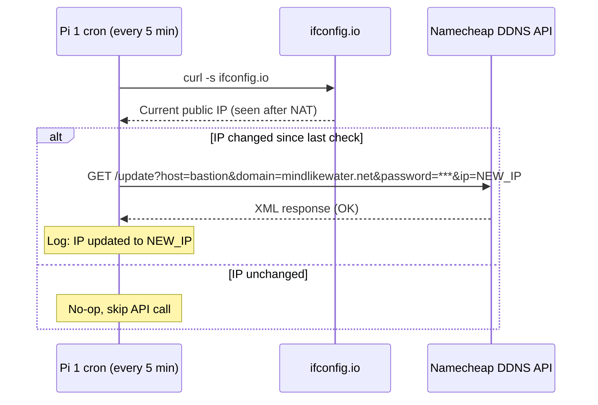
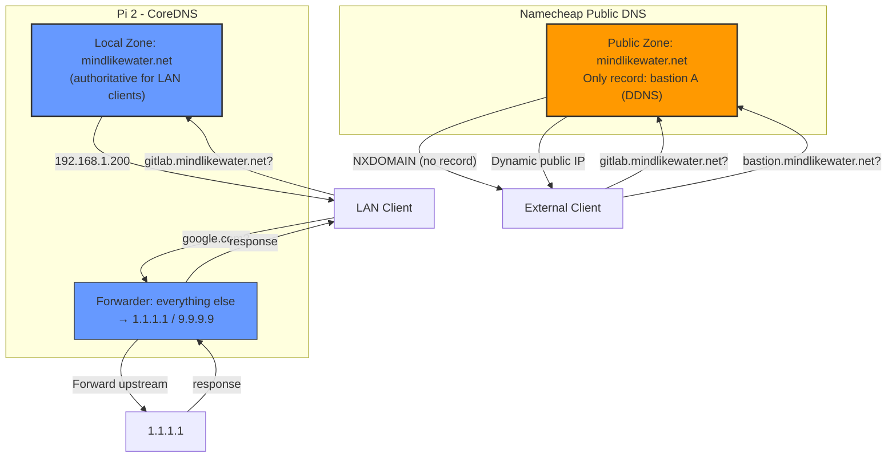
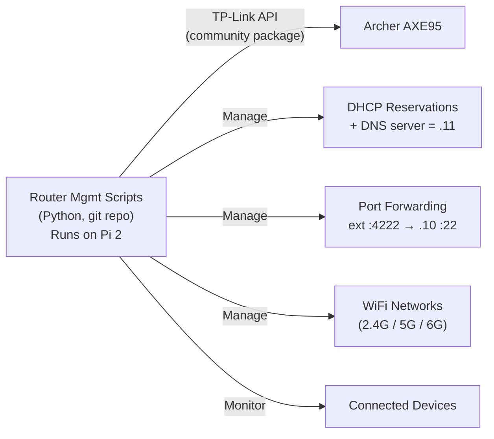
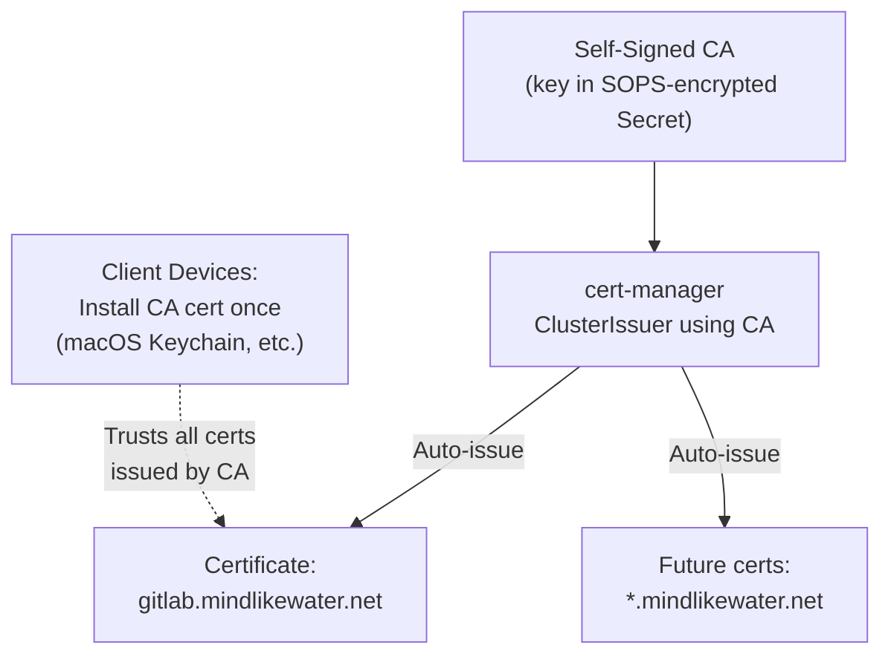
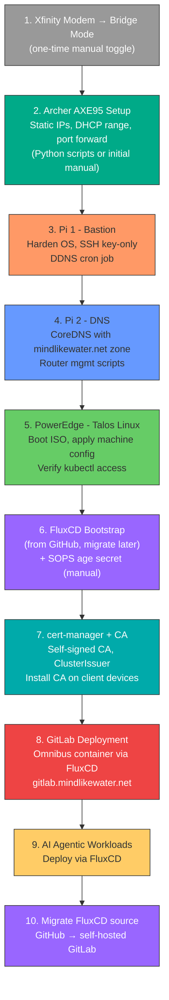

# Home Infrastructure Architecture

## Network Topology

## Remote Access Flow (SOCKS Proxy via Bastion)

## LAN Access Flow (Direct)

## DDNS Update Flow

## Split-Horizon DNS Configuration

## Router Management

## IP Address Scheme

| Range | Purpose | Hostnames |
|-------|---------|-----------|
| .1 | Router | router.mindlikewater.net |
| .2-.9 | Wired static clients | (no DNS names needed) |
| .10 | Pi 1 - Bastion + DDNS | bastion.mindlikewater.net |
| .11 | Pi 2 - DNS + Infra Mgmt | dns.mindlikewater.net |
| .12-.19 | Future Pis (hot backups) | *(reserved)* |
| .50-.59 | Wireless static clients | (no DNS names needed) |
| .100-.199 | DHCP dynamic range | *(auto-assigned)* |
| .200 | PowerEdge server | poweredge.mindlikewater.net |
| .201-.219 | Future servers | *(reserved)* |
| .220-.239 | MetalLB LoadBalancer pool | *(K8s assigns from pool)* |
| .240-.254 | Reserved | *(future use)* |

## DNS Records

### Pi DNS (CoreDNS) - Local Zone: mindlikewater.net

| Hostname | IP | Purpose |
|----------|----|---------|
| router.mindlikewater.net | 192.168.1.1 | Router admin |
| bastion.mindlikewater.net | 192.168.1.10 | Pi 1 (internal access) |
| dns.mindlikewater.net | 192.168.1.11 | Pi 2 (internal access) |
| poweredge.mindlikewater.net | 192.168.1.200 | Server direct access |
| k8s.mindlikewater.net | 192.168.1.200 | K8s API endpoint |
| gitlab.mindlikewater.net | 192.168.1.200 | GitLab (LAN + SOCKS tunnel) |

### Namecheap Public DNS - mindlikewater.net

| Record | Type | Value | Notes |
|--------|------|-------|-------|
| bastion | A (DDNS) | Dynamic public IP | Updated by Pi 1 cron |

*All other hostnames intentionally absent from public DNS.*

## TLS Certificates

## Architecture Decisions (All Resolved)

| # | Decision | Choice | Rationale |
|---|----------|--------|-----------|
| 1 | Xfinity modem mode | **Bridge** | Zero config after initial toggle. Router gets real public IP. No double NAT. |
| 2 | Primary router | **Archer AXE95** | Handles NAT, DHCP, firewall, WiFi. Programmable via Python TP-Link API. |
| 3 | Pi 1 role | **Bastion + DDNS** | DDNS is a cron job (zero attack surface). Both are edge concerns. |
| 4 | Pi 2 role | **DNS + Router Mgmt** | CoreDNS for split-horizon. Router scripts for infra-as-code. |
| 5 | DDNS placement | **Internal (on Pi 1)** | Namecheap API auto-detects IP via NAT. No WAN-side placement needed. |
| 6 | Bastion placement | **Inside router (on LAN)** | Router port-forwards SSH only. SSH key auth = bastion compromise requires breaking key auth regardless of placement. |
| 7 | DNS zone | **Single: mindlikewater.net** | Split-horizon: Pi DNS authoritative internally, Namecheap externally. No separate internal zone needed. |
| 8 | External access | **SOCKS proxy via bastion** | `ssh -D 1080` + browser with remote DNS. Single hostname works LAN and remote. |
| 9 | DNS software | **CoreDNS** | Lightweight, config-as-code, K8s-native style. No unnecessary extras. |
| 10 | Router management | **Python TP-Link API on Pi 2** | AXE95 v1.0 confirmed supported. Scripts in git, runs on always-on Pi. |
| 11 | MetalLB range | **.220-.239** | 20 IPs, plenty for single-node homelab. |
| 12 | TLS certificates | **Self-signed CA + cert-manager** | Automated cert issuance. CA cert installed on client devices once. |
| 13 | SSH external port | **Non-standard (4222)** | Reduces scanner noise. Not security-through-obscurity (key auth is the real gate). |
| 14 | Secrets management | **SOPS + age** | Git-committable encryption. 1Password backup for DR. FluxCD native integration. |

## Bootstrap Order

