# Home Infrastructure Architecture

## Network Topology

```mermaid
graph TD
    subgraph Internet
        ISP["Internet (Xfinity Cable)"]
        NAMECHEAP["Namecheap DNS<br/>mindlikewater.net<br/>Only record: bastion A (DDNS)"]
    end

    subgraph Edge["Edge - Modem (Bridge Mode Enabled 2026-02-01)"]
        MODEM["Xfinity XB8 (Technicolor CGM4981COM)<br/>BRIDGE MODE (enabled)<br/>Admin: 10.0.0.1 (.jst pages, requires Xfinity app unlock)<br/>Pass-through only - No NAT, No DHCP, No WiFi"]
    end

    subgraph Network["Internal Network - 192.168.1.0/24"]
        ROUTER["router.mindlikewater.net<br/>Archer AXE95 / AXE7800 - 192.168.1.1<br/>PRIMARY ROUTER: NAT + Firewall + DHCP + WiFi<br/>SSID: FBI_SURVEILLANCE_VAN<br/>Gets real public IP via bridge mode<br/>Port forward: ext :4222 → Pi 1 :22<br/>DHCP DNS: point clients to Pi 2 (.11)<br/>Managed via Python TP-Link API from Pi 2"]

        subgraph PiServices["Raspberry Pi Fleet (4 devices, 2 primary + 2 hot-backup)"]
            PI_BASTION["Pi 1 - BASTION + DDNS<br/>bastion.mindlikewater.net<br/>192.168.1.10<br/>───────────────<br/>SSH jump box (key-only, no passwords)<br/>DDNS cron: curl Namecheap API every 5 min<br/>Hardened: minimal Debian, unattended-upgrades<br/>No other services"]
            PI_DNS["Pi 2 - DNS + INFRA MGMT<br/>dns.mindlikewater.net<br/>192.168.1.11<br/>───────────────<br/>CoreDNS: split-horizon for mindlikewater.net<br/>Upstream: Cloudflare 1.1.1.1 / Quad9 9.9.9.9<br/>Router mgmt scripts (Python TP-Link API)<br/>Scripts sourced from git repo"]
            PI_BACKUP1["Pi 3 - HOT BACKUP (Bastion)<br/>192.168.1.12<br/>───────────────<br/>Identical config to Pi 1<br/>Standby: takes over if Pi 1 fails<br/>Synced via cron/rsync"]
            PI_BACKUP2["Pi 4 - HOT BACKUP (DNS)<br/>192.168.1.13<br/>───────────────<br/>Identical config to Pi 2<br/>Secondary DNS: clients can use as fallback<br/>Synced via cron/rsync"]
        end

        subgraph Server["Dell PowerEdge R630 - 192.168.1.200<br/>poweredge.mindlikewater.net<br/>192GB RAM / 36 cores / 3x 800GB SSD<br/>NOT ALWAYS ON (electricity cost) - K8s workloads are intermittent"]
            TALOS["Talos Linux<br/>Immutable OS<br/>API-managed via talosctl<br/>No SSH"]
            K8S["Single-Node Kubernetes<br/>k8s.mindlikewater.net<br/>allowSchedulingOnControlPlanes: true"]

            subgraph K8sWorkloads["K8s Workloads (all FluxCD-managed)"]
                FLUX["FluxCD<br/>GitOps Controller<br/>Source: Git repo<br/>SOPS decryption enabled"]
                SOPS_SECRET["SOPS + age<br/>In-cluster Secret<br/>(bootstrap: manual)"]
                CERTMGR["cert-manager<br/>Self-signed CA<br/>Auto-issues TLS certs"]
                GITLAB["GitLab Omnibus Container<br/>gitlab.mindlikewater.net<br/>(not Helm chart)<br/>Git + CI/CD + Registry"]
                AI["Future Workloads<br/>(no LLM runtime dependency)"]
                INGRESS["Ingress Controller<br/>(Traefik or nginx)"]
                METALLB["MetalLB<br/>LB IPs: .220-.239"]
            end
        end

        subgraph Clients["Client Devices"]
            WORK_MAC["Work MacBook<br/>.2 wired / .52 wifi"]
            PERSONAL_MAC["Personal MacBook<br/>.7 wired / .57 wifi"]
            GEEKOM["GeekOM Mini PC<br/>.3 wired / .53 wifi"]
            HP["Windows HP<br/>.4 wired / .54 wifi"]
        end
    end

    ISP -->|WAN| MODEM
    MODEM -->|"Ethernet (public IP pass-through)"| ROUTER

    ROUTER -->|LAN| PI_BASTION
    ROUTER -->|LAN| PI_DNS
    ROUTER -->|LAN| PI_BACKUP1
    ROUTER -->|LAN| PI_BACKUP2
    ROUTER -->|LAN| TALOS
    ROUTER -->|LAN / WiFi| WORK_MAC
    ROUTER -->|LAN / WiFi| PERSONAL_MAC
    ROUTER -->|LAN / WiFi| GEEKOM
    ROUTER -->|LAN / WiFi| HP

    ROUTER -.->|"Port forward<br/>ext :4222 → .10 :22"| PI_BASTION

    PI_BASTION -.->|"DDNS cron<br/>curl → Namecheap API"| NAMECHEAP
    PI_DNS -.->|"Upstream DNS<br/>(non-mindlikewater.net)"| ROUTER

    TALOS --> K8S
    K8S --> FLUX
    K8S --> SOPS_SECRET
    K8S --> CERTMGR
    K8S --> GITLAB
    K8S --> AI
    K8S --> INGRESS
    K8S --> METALLB
    FLUX -->|"Reconcile from Git"| GITLAB

    ROUTER -.->|"DHCP: DNS server = .11"| PI_DNS

    style MODEM fill:#999,stroke:#333,stroke-width:1px,color:#fff
    style ROUTER fill:#0a8,stroke:#333,stroke-width:2px,color:#fff
    style PI_BASTION fill:#f96,stroke:#333,stroke-width:2px
    style PI_DNS fill:#69f,stroke:#333,stroke-width:2px
    style TALOS fill:#6c6,stroke:#333,stroke-width:2px
    style K8S fill:#6c6,stroke:#333,stroke-width:1px
    style GITLAB fill:#e44,stroke:#333,stroke-width:2px,color:#fff
    style FLUX fill:#96f,stroke:#333,stroke-width:2px,color:#fff
    style AI fill:#fc6,stroke:#333,stroke-width:2px
    style CERTMGR fill:#0aa,stroke:#333,stroke-width:1px,color:#fff
    style INGRESS fill:#888,stroke:#333,stroke-width:1px,color:#fff
    style METALLB fill:#888,stroke:#333,stroke-width:1px,color:#fff
    style SOPS_SECRET fill:#888,stroke:#333,stroke-width:1px,color:#fff
    style PI_BACKUP1 fill:#fa6,stroke:#333,stroke-width:1px
    style PI_BACKUP2 fill:#69f,stroke:#333,stroke-width:1px
```

## Remote Access Flow (SOCKS Proxy via Bastion)

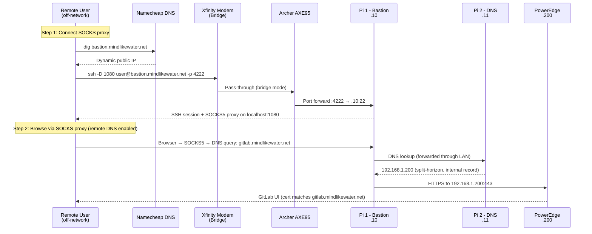

## LAN Access Flow (Direct)

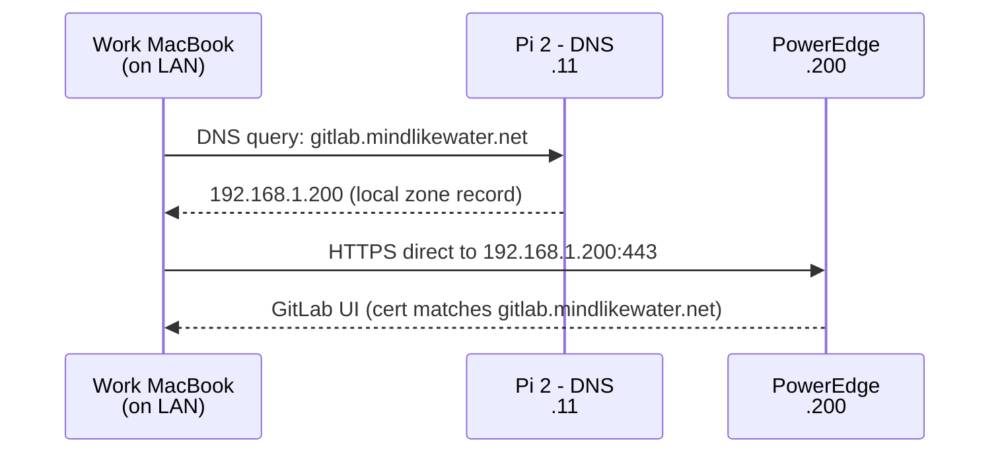

## DDNS Update Flow

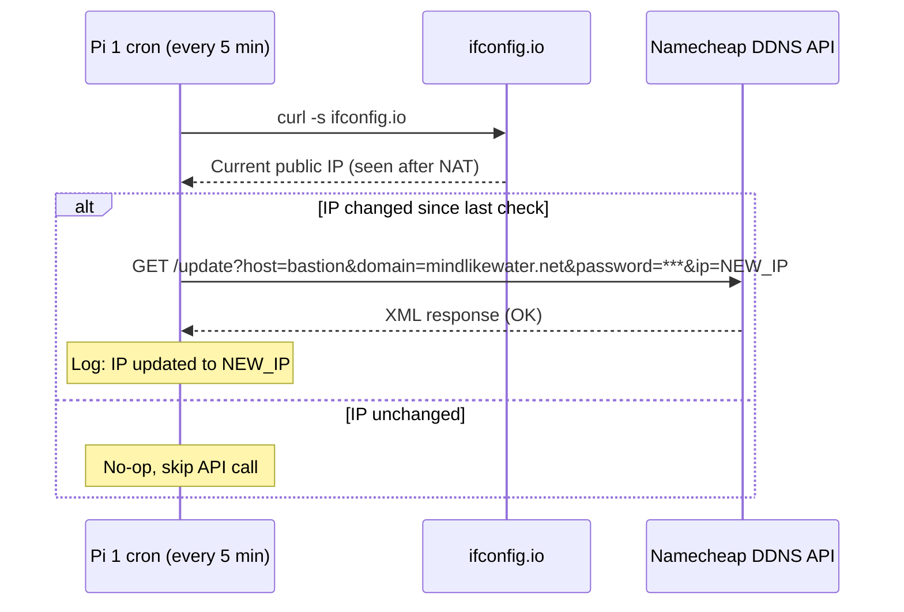

## Split-Horizon DNS Configuration

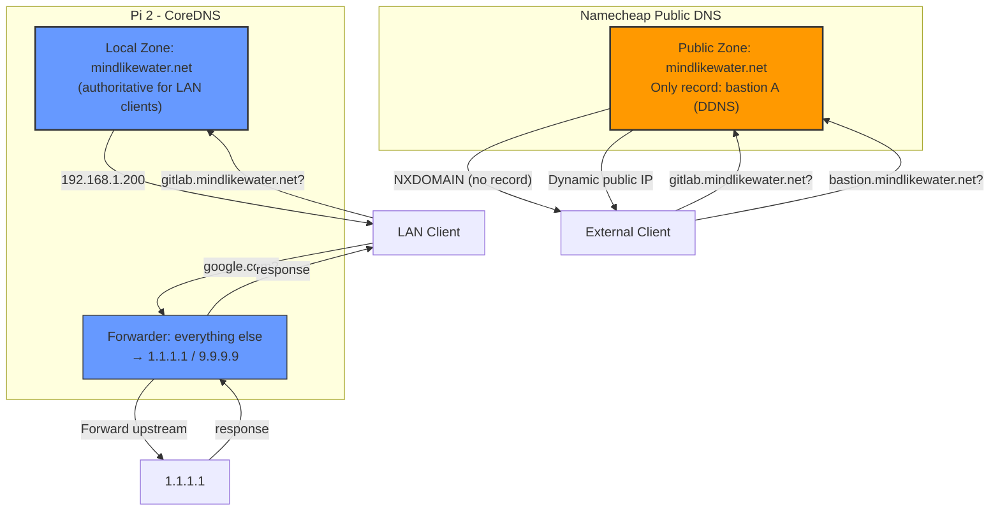

## Router Management

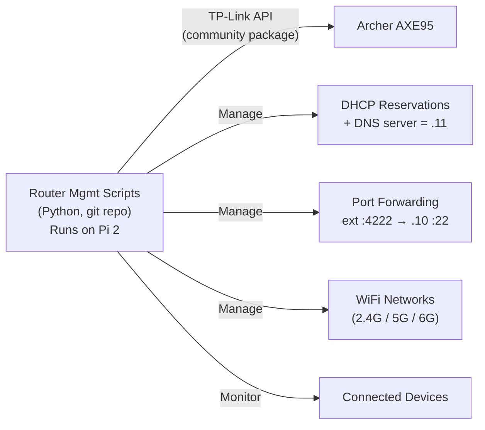

## IP Address Scheme

| Range | Purpose | Hostnames |
|-------|---------|-----------|
| .1 | Router | router.mindlikewater.net |
| .2-.9 | Wired static clients | (no DNS names needed) |
| .10 | Pi 1 - Bastion + DDNS | bastion.mindlikewater.net |
| .11 | Pi 2 - DNS + Infra Mgmt | dns.mindlikewater.net |
| .12 | Pi 3 - Hot Backup (Bastion) | *(standby for Pi 1)* |
| .13 | Pi 4 - Hot Backup (DNS) | *(standby/secondary for Pi 2)* |
| .14-.19 | Future Pis | *(reserved)* |
| .50-.59 | Wireless static clients | (no DNS names needed) |
| .100-.199 | DHCP dynamic range | *(auto-assigned)* |
| .200 | PowerEdge server | poweredge.mindlikewater.net |
| .201-.219 | Future servers | *(reserved)* |
| .220-.239 | MetalLB LoadBalancer pool | *(K8s assigns from pool)* |
| .240-.254 | Reserved | *(future use)* |

## DNS Records

### Pi DNS (CoreDNS) - Local Zone: mindlikewater.net

| Hostname | IP | Purpose |
|----------|----|---------|
| router.mindlikewater.net | 192.168.1.1 | Router admin |
| bastion.mindlikewater.net | 192.168.1.10 | Pi 1 (internal access) |
| dns.mindlikewater.net | 192.168.1.11 | Pi 2 (internal access) |
| poweredge.mindlikewater.net | 192.168.1.200 | Server direct access |
| k8s.mindlikewater.net | 192.168.1.200 | K8s API endpoint |
| gitlab.mindlikewater.net | 192.168.1.200 | GitLab (LAN + SOCKS tunnel) |

### Namecheap Public DNS - mindlikewater.net

| Record | Type | Value | Notes |
|--------|------|-------|-------|
| bastion | A (DDNS) | Dynamic public IP | Updated by Pi 1 cron |

*All other hostnames intentionally absent from public DNS.*

## TLS Certificates

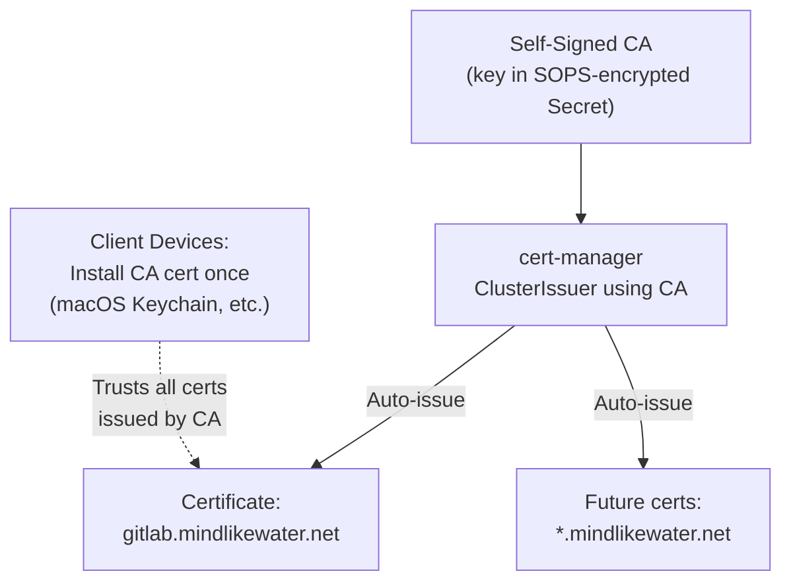

## Architecture Decisions (All Resolved)

| # | Decision | Choice | Rationale |
|---|----------|--------|-----------|
| 1 | Xfinity modem mode | **Bridge** | Enabled 2026-02-01. XB8 Technicolor CGM4981COM. Local admin at 10.0.0.1 (.jst pages) -- must first enable "Admin Tool online access" via Xfinity app. Router gets real public IP. No double NAT. |
| 2 | Primary router | **Archer AXE95** | Handles NAT, DHCP, firewall, WiFi. Programmable via Python TP-Link API. |
| 3 | Pi 1 role | **Bastion + DDNS** | DDNS is a cron job (zero attack surface). Both are edge concerns. |
| 4 | Pi 2 role | **DNS + Router Mgmt** | CoreDNS for split-horizon. Router scripts for infra-as-code. |
| 5 | DDNS placement | **Internal (on Pi 1)** | Namecheap API auto-detects IP via NAT. No WAN-side placement needed. |
| 6 | Bastion placement | **Inside router (on LAN)** | Router port-forwards SSH only. SSH key auth = bastion compromise requires breaking key auth regardless of placement. |
| 7 | DNS zone | **Single: mindlikewater.net** | Split-horizon: Pi DNS authoritative internally, Namecheap externally. No separate internal zone needed. |
| 8 | External access | **SOCKS proxy via bastion** | `ssh -D 1080` + browser with remote DNS. Single hostname works LAN and remote. |
| 9 | DNS software | **CoreDNS** | Lightweight, config-as-code, K8s-native style. No unnecessary extras. |
| 10 | Router management | **Python TP-Link API on Pi 2** | AXE95 v1.0 confirmed supported. Scripts in git, runs on always-on Pi. |
| 11 | MetalLB range | **.220-.239** | 20 IPs, plenty for single-node homelab. |
| 12 | TLS certificates | **Self-signed CA + cert-manager** | Automated cert issuance. CA cert installed on client devices once. |
| 13 | SSH external port | **Non-standard (4222)** | Reduces scanner noise. Not security-through-obscurity (key auth is the real gate). |
| 14 | Secrets management | **SOPS + age** | Git-committable encryption. 1Password backup for DR. FluxCD native integration. |
| 15 | K8s repo layout | **onedr0p/cluster-template pattern** | `kubernetes/{apps,bootstrap,components,flux}` -- community standard for Talos+FluxCD homelabs. |
| 16 | Community charts | **Helm via FluxCD HelmRelease** | cert-manager, MetalLB, ingress via HelmRelease CRD. Version bumps = one-line change. |
| 17 | Pi configuration | **Ansible-compatible shell scripts** | Idempotent bash scripts structured so they can be converted to Ansible later if needed. No Ansible dependency for 4 Pis. |
| 18 | Dependency updates | **Renovate Bot from day one** | Auto-creates PRs for Helm chart, container image, and Flux component updates. |
| 19 | CNI | **Talos default + MetalLB** | Start simple. Cilium is powerful but unnecessary complexity for single-node. Can migrate later. |
| 20 | Talos config mgmt | **talhelper** | Generates Talos machine configs from simpler YAML input. Used by onedr0p template. |
| 21 | K8s availability | **Intermittent (not always on)** | PowerEdge runs only when needed (electricity cost). Pis are always-on for DNS and bastion. |
| 22 | Pi redundancy | **Hot-backup Pis (4 total)** | Pi 3 mirrors Pi 1 (bastion), Pi 4 mirrors Pi 2 (DNS). Config sync via cron/rsync. Pi 4 as secondary DNS in DHCP. |
| 23 | Infrastructure testing | **Full test pyramid** | bats-core for shell script unit tests, goss for host verification, integration tests against real Pis. |
| 24 | Pi secrets (non-K8s) | **SOPS + age (unified)** | Same tooling as K8s secrets. Pi scripts decrypt at deploy time. SSH keys and API tokens managed via SOPS. |
| 25 | Project scope | **AI-automated home network** | Not primarily K8s/GitLab. The project manages the entire home network: modem, router, Pis, DNS, bastion, server. |
| 26 | Secrets file layout | **Single file per tier** | One `secrets.enc.yaml` for all Pi secrets. One per K8s app. Simplicity over organization until it doesn't scale. |
| 27 | Shell script conventions | **Function-based, idempotent, sourceable** | `set -euo pipefail`, functions with idempotent guards, `main` behind source guard. Maps 1:1 to Ansible tasks. |
| 28 | CoreDNS config style | **hosts plugin + generated hosts file** | Simpler than RFC zone files. Hosts file generated from inventory. Corefile is static. |
| 29 | MVP CI strategy | **Local Makefile only (no GitHub Actions)** | Integration/acceptance tests need LAN access to Pis. GHA adds ceremony with no benefit. GitLab CI on LAN post-MVP. |
| 30 | Pi base image | **RPi OS Lite 64-bit (Bookworm)** | Minimal, arm64, no desktop. CoreDNS and goss are arm64 binaries. |
| 31 | Deploy pipeline | **3-phase (decrypt → push → run)** | Each phase testable independently. Clear failure points. Secrets shredded after push. |
| 32 | Pi smoke test | **`make verify-pi` (goss on Pi)** | Runs goss immediately after deploy, before connecting to network. Catches setup failures early. |
| 33 | MVP health monitoring | **`make health-check` script via cron** | Simple DNS + SSH + process checks every 15 min for 24h after cut-over. No monitoring stack for MVP. |

## Repository Structure

```
home-tech-infrastructure/
├── _bmad/                          # BMAD framework
├── _bmad-output/                   # BMAD planning artifacts
├── reference/                      # Vendor docs
│
├── kubernetes/                     # Everything FluxCD manages
│   ├── apps/                       # Workloads
│   │   ├── gitlab/
│   │   │   ├── ks.yaml             # Flux Kustomization
│   │   │   └── app/
│   │   │       ├── deployment.yaml # GitLab Omnibus (not Helm)
│   │   │       ├── secrets.enc.yaml
│   │   │       └── kustomization.yaml
│   │   └── ai-agents/
│   │       └── ...
│   ├── bootstrap/                  # Flux bootstrap
│   │   └── kustomization.yaml
│   ├── components/                 # Reusable Kustomize components
│   └── flux/                       # Flux system config
│       └── config/
│           └── cluster.yaml
│
├── infrastructure/                 # Non-K8s infra-as-code
│   ├── pi-scripts/                 # Ansible-compatible shell scripts for Pis
│   │   ├── inventory.sh            # Pi IPs, roles, hostnames
│   │   ├── common/                 # Shared: updates, hardening, user setup
│   │   │   ├── harden.sh
│   │   │   ├── unattended-upgrades.sh
│   │   │   └── setup-goss.sh       # Install goss for integration testing
│   │   ├── bastion/                # Pi 1 + Pi 3 (hot backup)
│   │   │   ├── setup-bastion.sh    # SSH hardening, key-only auth
│   │   │   └── setup-ddns.sh       # DDNS cron job
│   │   ├── dns/                    # Pi 2 + Pi 4 (hot backup)
│   │   │   ├── setup-coredns.sh    # CoreDNS install + zone config
│   │   │   └── setup-router-mgmt.sh # TP-Link API Python env
│   │   └── sync/                   # Hot-backup sync scripts
│   │       ├── sync-bastion.sh     # Pi 1 → Pi 3 config sync
│   │       └── sync-dns.sh         # Pi 2 → Pi 4 config sync
│   └── talos/
│       ├── talconfig.yaml          # talhelper config
│       └── patches/                # Talos config patches
│
├── scripts/                        # Operational helpers
│   ├── bootstrap/
│   │   ├── generate-age-keypair.sh
│   │   └── install-ca-cert.sh
│   ├── deploy/                     # 3-phase deploy pipeline
│   │   ├── decrypt.sh              # Phase 1: SOPS decrypt to temp
│   │   ├── push.sh                 # Phase 2: scp to Pi
│   │   ├── run-setup.sh            # Phase 3: ssh + run on Pi
│   │   └── prep-pi-image.sh        # First-boot checklist for new Pi
│   ├── ops/
│   │   └── health-check.sh         # Health check (DNS, SSH, CoreDNS)
│   └── ddns/
│       └── update-namecheap.sh     # Deployed to Pi 1 by setup script
│
├── tests/                          # Infrastructure test suite
│   ├── unit/                       # bats-core shell script tests
│   │   ├── test_ddns_update.bats
│   │   ├── test_coredns_config.bats
│   │   └── test_inventory.bats
│   ├── integration/                # goss host verification specs
│   │   ├── bastion.yaml            # Verify Pi 1 config
│   │   ├── dns.yaml                # Verify Pi 2 config
│   │   └── common.yaml             # Verify shared config
│   └── acceptance/                 # End-to-end network tests
│       ├── test_dns_resolution.sh
│       ├── test_ddns_propagation.sh
│       └── test_socks_proxy.sh
│
├── .sops.yaml                      # SOPS config (public key only)
├── .gitignore
├── CLAUDE.md
├── Makefile                        # Developer commands
├── renovate.json                   # Dependency auto-updates
└── README.md
```

### Structure Rationale

| Directory | Pattern | Source |
|-----------|---------|--------|
| `kubernetes/` | onedr0p/cluster-template convention | Community standard for Talos+FluxCD |
| `kubernetes/apps/*/ks.yaml` + `app/` | FluxCD Kustomization per-app | onedr0p pattern for dependency ordering |
| `infrastructure/pi-scripts/` | Ansible-compatible shell scripts | Idempotent bash, structured for Ansible migration. No Ansible overhead for 4 Pis. |
| `infrastructure/talos/` | talhelper-managed configs | onedr0p template tooling |
| `scripts/` | One-off helpers and deployment scripts | Bootstrap, deploy-to-pi, operational scripts |
| `tests/` | Full test pyramid (unit/integration/acceptance) | bats-core, goss, end-to-end network tests |
| `renovate.json` | Renovate Bot config | Auto-dependency updates from day one |

### What Uses Helm (HelmRelease) vs Raw Manifests (Kustomize)

| Component | Method | Why |
|-----------|--------|-----|
| cert-manager | **HelmRelease** | Community chart, complex, version-tracked upstream |
| MetalLB | **HelmRelease** | Community chart |
| Ingress controller | **HelmRelease** | Community chart |
| GitLab Omnibus | **Raw manifests** | Simple Deployment, Chad knows Omnibus internals |
| AI workloads | **Raw manifests** | Custom, no upstream chart |
| SOPS age Secret | **Raw manifest** | Bootstrap, one-time |

## Bootstrap Order

```mermaid
flowchart TD
    B1["1. Xfinity Modem → Bridge Mode<br/>(one-time manual toggle)"]
    B2["2. Archer AXE95 Setup<br/>Static IPs, DHCP range, port forward<br/>(Python TP-Link API or initial manual)"]
    B3["3. Pi 1 - Bastion (shell scripts)<br/>Harden OS, SSH key-only<br/>DDNS cron job"]
    B4["4. Pi 2 - DNS (shell scripts)<br/>CoreDNS with mindlikewater.net zone<br/>Router mgmt scripts"]
    B4B["4b. Pi 3+4 - Hot Backups<br/>Clone config from Pi 1+2<br/>Setup sync cron jobs"]
    B5["5. Run tests<br/>bats-core unit tests on scripts<br/>goss verification on all Pis"]
    B6["6. PowerEdge - Talos Linux<br/>Boot ISO, apply machine config<br/>Verify kubectl access"]
    B7["7. FluxCD Bootstrap<br/>(from GitHub, migrate later)<br/>+ SOPS age secret (manual)"]
    B8["8. cert-manager + CA<br/>Self-signed CA, ClusterIssuer<br/>Install CA on client devices"]
    B9["9. GitLab Deployment<br/>Omnibus container via FluxCD<br/>gitlab.mindlikewater.net"]
    B10["10. Future Workloads<br/>Deploy via FluxCD"]
    B11["11. Migrate FluxCD source<br/>GitHub → self-hosted GitLab"]

    B1 --> B2 --> B3 --> B4 --> B4B --> B5 --> B6 --> B7 --> B8 --> B9 --> B10 --> B11

    style B1 fill:#999,stroke:#333,color:#fff
    style B2 fill:#0a8,stroke:#333,color:#fff
    style B3 fill:#f96,stroke:#333
    style B4 fill:#69f,stroke:#333
    style B4B fill:#fa6,stroke:#333
    style B5 fill:#0a0,stroke:#333,color:#fff
    style B6 fill:#6c6,stroke:#333
    style B7 fill:#96f,stroke:#333,color:#fff
    style B8 fill:#0aa,stroke:#333,color:#fff
    style B9 fill:#e44,stroke:#333,color:#fff
    style B10 fill:#fc6,stroke:#333
    style B11 fill:#96f,stroke:#333,color:#fff
```

## Testing Strategy (Full Pyramid)

### Test Pyramid Overview

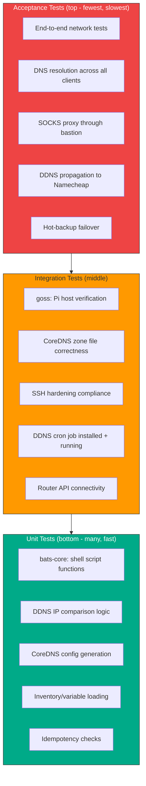

### Unit Tests (bats-core)

**Tool**: [bats-core](https://github.com/bats-core/bats-core) (Bash Automated Testing System)

Test shell script functions in isolation. Fast, no Pi hardware needed.

| What to test | Example assertion |
|---|---|
| DDNS IP-change detection | `assert_equal "$(detect_ip_change "1.2.3.4" "1.2.3.4")" "unchanged"` |
| CoreDNS zone file generation | `assert_output --partial "bastion.mindlikewater.net"` |
| Inventory variable loading | `assert_equal "$PI1_IP" "192.168.1.10"` |
| Idempotent script re-runs | `run setup_bastion.sh && run setup_bastion.sh` -- no errors, no changes |
| Input validation | `run setup_bastion.sh --ip "not-an-ip"` -- exits non-zero |

**Conventions**:
- Tests live in `tests/unit/*.bats`
- Each Pi role script (`bastion/`, `dns/`, `common/`) has corresponding test file
- Scripts must be structured with functions (not just top-level commands) so functions are testable
- Source scripts in tests: `source infrastructure/pi-scripts/bastion/setup-ddns.sh`
- Use `bats-assert` and `bats-support` helper libraries

### Integration Tests (goss)

**Tool**: [goss](https://github.com/goss-org/goss) (Quick and easy server testing)

Verify actual Pi configuration state. Runs on the Pi (or in a container simulating it).

| What to verify | goss spec |
|---|---|
| CoreDNS binary installed | `command: coredns: exists: true` |
| CoreDNS service running | `service: coredns: running: true, enabled: true` |
| SSH password auth disabled | `file: /etc/ssh/sshd_config: contains: ["PasswordAuthentication no"]` |
| Unattended-upgrades installed | `package: unattended-upgrades: installed: true` |
| DDNS cron job present | `command: crontab -l: stdout: ["/update-namecheap.sh"]` |
| Port 22 listening (bastion) | `port: tcp:22: listening: true` |
| Port 53 listening (DNS) | `port: tcp:53: listening: true` |
| DNS resolves correctly | `command: dig @localhost gitlab.mindlikewater.net: stdout: ["192.168.1.200"]` |

**Conventions**:
- Specs live in `tests/integration/*.yaml`
- Run on Pi via `goss --gossfile tests/integration/bastion.yaml validate`
- Can also run in CI using `dgoss` (Docker wrapper) against a Debian container
- Include in `make test-integration` target

### Acceptance Tests (end-to-end)

Test the actual user experience of the network. These run from a client machine (or the CI box) against the real network.

| Scenario | How tested |
|---|---|
| Internal DNS resolution | From LAN client: `dig @192.168.1.11 gitlab.mindlikewater.net` returns `.200` |
| External DNS (public) | `dig @8.8.8.8 bastion.mindlikewater.net` returns current public IP |
| SOCKS proxy works | `ssh -D 1080 bastion && curl --socks5-hostname localhost:1080 https://gitlab.mindlikewater.net` |
| DDNS updates on IP change | Simulate IP change, wait 5 min, verify Namecheap record updated |
| Hot-backup failover | Stop CoreDNS on Pi 2, verify Pi 4 resolves queries as secondary |
| Router API reachable | `python -c "from tplinkrouterc6u import TplinkRouter; ..."` from Pi 2 |

**Conventions**:
- Tests live in `tests/acceptance/test_*.sh`
- Run with `make test-acceptance` (requires network access to real Pis)
- Should mirror what a human would do to verify the system works

### Makefile Targets

```makefile
test:              ## Run all tests
test-unit:         ## Run bats-core unit tests (no Pi needed)
test-integration:  ## Run goss specs on Pis (requires SSH access)
test-acceptance:   ## Run end-to-end network tests (requires live network)
test-ci:           ## Run unit tests only (for CI without hardware)
lint:              ## ShellCheck all shell scripts
```

## Secrets Management Strategy

### Two-Tier Approach

All secrets use **SOPS + age** encryption, with scope covering both K8s and Pi infrastructure.

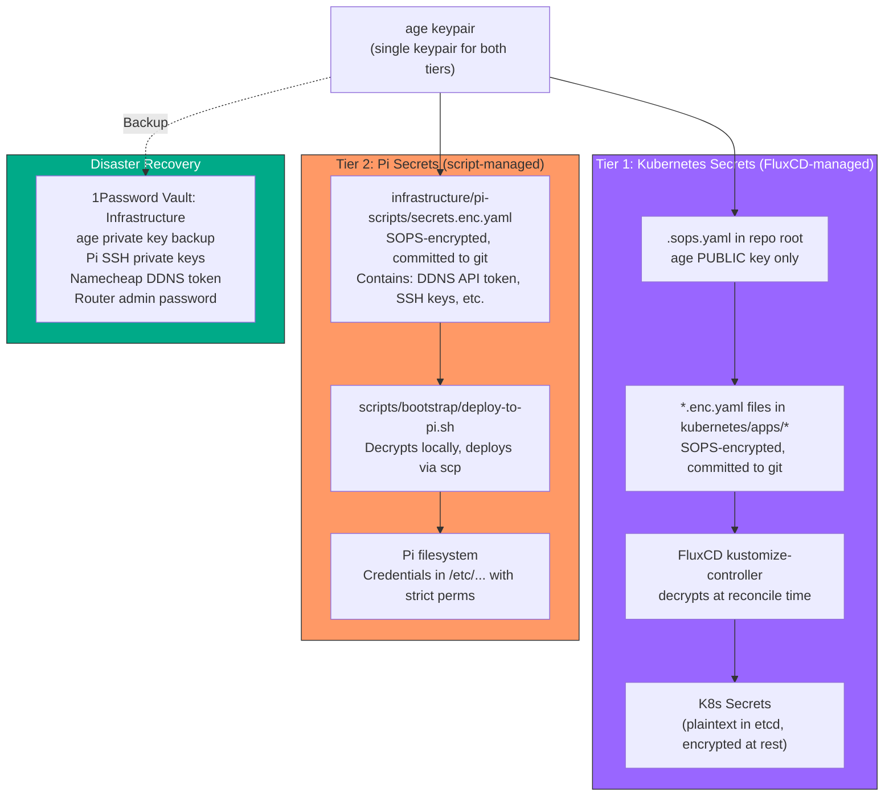

### SSH Key Strategy

Three keypairs, each with a distinct purpose:

| Key | Purpose | Private key location | In SOPS? |
|-----|---------|---------------------|----------|
| Personal key(s) | Manual SSH from laptops | Laptops + 1Password | No |
| CI/deploy key | `deploy-to-pi.sh`, goss tests, acceptance tests | SOPS-encrypted in repo + CI runner | **Yes** |
| Pi host keys (backup) | Prevent MITM warnings after Pi re-flash | On each Pi (+ SOPS backup in repo) | **Yes** |

- SSH **public** keys (authorized_keys) are not secret -- committed to git unencrypted
- CI/deploy **private** key is the only SSH private key in SOPS
- Personal private keys never touch the repo or SOPS

### What Gets Encrypted

Single file for all Pi secrets: `infrastructure/pi-scripts/secrets.enc.yaml`

| Secret | Tier | Encrypted file | Used by |
|--------|------|----------------|---------|
| CI/deploy SSH private key | Pi | `infrastructure/pi-scripts/secrets.enc.yaml` | deploy-to-pi.sh, CI, goss, acceptance tests |
| Namecheap DDNS password | Pi | `infrastructure/pi-scripts/secrets.enc.yaml` | Pi 1 DDNS cron |
| Router admin password | Pi | `infrastructure/pi-scripts/secrets.enc.yaml` | Pi 2 router mgmt scripts |
| Pi host key backups | Pi | `infrastructure/pi-scripts/secrets.enc.yaml` | Pi re-flash recovery |
| GitLab root password | K8s | `kubernetes/apps/gitlab/app/secrets.enc.yaml` | GitLab Omnibus container |
| GitLab runner token | K8s | `kubernetes/apps/gitlab/app/secrets.enc.yaml` | CI runners |
| Self-signed CA private key | K8s | `kubernetes/components/cert-manager/secrets.enc.yaml` | cert-manager |
| age private key | N/A | **Never in git** | SOPS decrypt operations |

### Bootstrap Procedure

1. **Generate age keypair**: `age-keygen -o age.key` (outputs public + private key)
2. **Back up to 1Password**: Store private key in 1Password vault "Infrastructure"
3. **Create `.sops.yaml`**: Commit to repo with public key only
4. **Encrypt Pi secrets**: `sops --encrypt infrastructure/pi-scripts/secrets.enc.yaml`
5. **Deploy to Pis**: `scripts/bootstrap/deploy-to-pi.sh` decrypts + copies via scp
6. **Bootstrap K8s**: `kubectl create secret generic sops-age -n flux-system --from-file=age.agekey=age.key` (one manual step)
7. **Encrypt K8s secrets**: `sops --encrypt kubernetes/apps/gitlab/app/secrets.enc.yaml`
8. **Shred local key**: `shred -u age.key`

### Pi Script Decrypt Pattern

```bash
#!/usr/bin/env bash
# deploy-to-pi.sh - decrypt secrets and deploy to target Pi
# Requires: SOPS_AGE_KEY_FILE or SOPS_AGE_KEY environment variable

set -euo pipefail

SECRETS_FILE="infrastructure/pi-scripts/secrets.enc.yaml"

# Decrypt to temp, extract specific values, deploy, then shred
DDNS_TOKEN=$(sops --decrypt --extract '["ddns_token"]' "$SECRETS_FILE")
# ... scp to Pi, set perms, shred temp files
```

### Disaster Recovery

| Scenario | Recovery steps |
|----------|---------------|
| **Pi SD card failure** | Flash new SD, run `deploy-to-pi.sh` with age key from 1Password |
| **K8s cluster loss** | Rebuild Talos, bootstrap FluxCD, recreate sops-age Secret from 1Password |
| **age key compromise** | Generate new keypair, `sops --rotate` all encrypted files, update K8s Secret, redeploy to Pis |
| **1Password unavailable** | age key also exists in K8s cluster Secret; can extract with `kubectl get secret sops-age -n flux-system -o yaml` |

### .gitignore Additions (Required)

```
# Never commit unencrypted secrets or private keys
*.dec.yaml
age.key
*.agekey
```

## Hot-Backup Pi Architecture

### Failover Strategy

| Primary | Backup | Failover mechanism |
|---------|--------|-------------------|
| Pi 1 (.10) Bastion+DDNS | Pi 3 (.12) | Manual IP swap or keepalived VRRP (future) |
| Pi 2 (.11) DNS+RouterMgmt | Pi 4 (.13) | DHCP serves both .11 and .13 as DNS servers; automatic client fallback |

### Sync Strategy

- **Config sync**: Cron job (every 15 min) rsync from primary → backup
- **What syncs**: `/etc/coredns/`, `/etc/ssh/sshd_config`, cron jobs, installed packages list
- **What does NOT sync**: Runtime state, logs, temp files
- **Sync direction**: One-way (primary → backup). Backup is read-only replica.
- **DNS failover**: DHCP gives clients both Pi 2 and Pi 4 as DNS servers. If Pi 2 dies, clients auto-fallback to Pi 4.
- **Bastion failover**: Manual for now (update router port forward to .12). Keepalived/VRRP is a future option for automatic failover.

## MVP: Pi Infrastructure Layer

**Goal**: Get Pi 1 (bastion+DDNS) and Pi 2 (DNS) running with full test coverage, without breaking the existing network. No K8s, no modem/router changes required.

### MVP Scope

| In scope | Out of scope (later increments) |
|----------|--------------------------------|
| age keypair + SOPS bootstrap | K8s / Talos / PowerEdge |
| Repo scaffolding (Makefile, tests/) | Bridge mode toggle |
| Pi setup scripts + bats-core tests | Hot-backup Pis (Pi 3+4) |
| Single `secrets.enc.yaml` for Pi tier | GitLab, AI workloads |
| Deploy Pi 1 (bastion) + Pi 2 (DNS) | FluxCD, cert-manager |
| goss integration tests on Pis | Renovate Bot |
| Acceptance tests (DNS, SSH, DDNS) | Router management automation |
| DHCP cut-over to Pi DNS | |

### MVP Steps

```mermaid
flowchart TD
    M0["0. Generate age keypair<br/>Back up to 1Password<br/>Create .sops.yaml"]
    M1["1. Repo scaffolding<br/>Makefile, tests/, infrastructure/pi-scripts/<br/>Install bats-core, shellcheck, goss"]
    M2["2. Write common scripts + tests<br/>harden.sh, unattended-upgrades.sh<br/>goss install (common/setup-goss.sh)"]
    M3["3. Write bastion scripts + tests<br/>setup-bastion.sh, setup-ddns.sh"]
    M4["4. Write DNS scripts + tests<br/>setup-coredns.sh, CoreDNS zone config"]
    M5["5. Encrypt secrets<br/>CI/deploy SSH key, DDNS password<br/>into secrets.enc.yaml"]
    M6["6. Write deploy pipeline<br/>decrypt.sh → push.sh → run-setup.sh<br/>+ bats-core tests for each phase"]
    M7["7. Flash Pi (RPi OS Lite 64-bit)<br/>make prep-pi-image ROLE=bastion<br/>(enable SSH, set static IP, add deploy key)"]
    M7B["7b. Deploy + verify on desk<br/>make deploy-pi ROLE=bastion TARGET=IP<br/>make verify-pi TARGET=IP<br/>(not on network yet)"]
    M8["8. Connect Pi 2 to LAN<br/>make verify-pi TARGET=192.168.1.11<br/>(existing DHCP DNS unchanged)"]
    M9["9. Connect Pi 1 to LAN<br/>Add router port forward :4222<br/>Test SSH from outside"]
    M10["10. Run acceptance tests<br/>make test-acceptance<br/>(DNS resolution, SOCKS proxy)"]
    M11["11. CUT-OVER: Point DHCP DNS to Pi 2<br/>(see Rollback Procedure below)"]
    M12["12. Verify + health check<br/>make test-acceptance<br/>make health-check (cron every 15 min for 24h)"]

    M0 --> M1 --> M2 --> M3 --> M4 --> M5 --> M6 --> M7 --> M7B
    M7B --> M8 --> M9 --> M10 --> M11 --> M12

    style M0 fill:#888,stroke:#333,color:#fff
    style M1 fill:#888,stroke:#333,color:#fff
    style M2 fill:#0a8,stroke:#333,color:#fff
    style M3 fill:#f96,stroke:#333
    style M4 fill:#69f,stroke:#333
    style M5 fill:#96f,stroke:#333,color:#fff
    style M6 fill:#96f,stroke:#333,color:#fff
    style M7 fill:#0a0,stroke:#333,color:#fff
    style M7B fill:#0a0,stroke:#333,color:#fff
    style M8 fill:#69f,stroke:#333
    style M9 fill:#f96,stroke:#333
    style M10 fill:#0a0,stroke:#333,color:#fff
    style M11 fill:#e44,stroke:#333,color:#fff
    style M12 fill:#0a0,stroke:#333,color:#fff
```

### MVP Definition of Done

- [ ] age keypair generated, backed up to 1Password, `.sops.yaml` committed
- [ ] `secrets.enc.yaml` committed with CI/deploy SSH key + DDNS password
- [ ] All Pi setup scripts written with function-based structure (overridable paths for testing)
- [ ] `make lint` passes (shellcheck on all scripts)
- [ ] `make test-unit` passes (bats-core tests for all script functions)
- [ ] `make deploy-pi ROLE=bastion TARGET=192.168.1.10` works (3-phase: decrypt, push, run)
- [ ] `make deploy-pi ROLE=dns TARGET=192.168.1.11` works
- [ ] `make verify-pi TARGET=192.168.1.10` passes (goss on Pi after deploy, before network)
- [ ] `make test-integration` passes (goss on both Pis from laptop)
- [ ] `make test-acceptance` passes (DNS resolution, SOCKS proxy)
- [ ] DHCP DNS pointed to Pi 2, all clients resolving correctly
- [ ] `make health-check` runs every 15 min for 24h with no failures
- [ ] Rollback procedure documented and tested

### Pi Base Image

**Raspberry Pi OS Lite (64-bit, Debian Bookworm)** -- no desktop, arm64, minimal.

The `make prep-pi-image` target runs a checklist script that configures a freshly flashed SD card:

| Setting | How |
|---|---|
| Enable SSH | Touch `/boot/ssh` on the SD card |
| Set hostname | Write to `/boot/hostname` or `raspi-config` on first boot |
| Static IP | Configure in `/etc/dhcpcd.conf` (or via router DHCP reservation) |
| Deploy user | Create `deploy` user, add CI/deploy public key to `authorized_keys` |
| Locale/timezone | Set via `raspi-config` noninteractive |

This is a manual flash + scripted first-boot config for MVP. Full automated imaging (Packer, pi-gen) is post-MVP.

### Deploy Pipeline (3-Phase)

The deploy process is split into three independently testable phases:

```
make deploy-pi ROLE=bastion TARGET=192.168.1.10
    │
    ├── Phase 1: decrypt (local)
    │   scripts/deploy/decrypt.sh
    │   → Decrypts secrets.enc.yaml to temp dir
    │   → Extracts role-specific secrets
    │
    ├── Phase 2: push (local → Pi)
    │   scripts/deploy/push.sh ROLE TARGET
    │   → scp setup scripts to Pi:/opt/pi-setup/
    │   → scp decrypted secrets to Pi (strict perms)
    │
    └── Phase 3: run (on Pi)
        scripts/deploy/run-setup.sh ROLE TARGET
        → ssh deploy@TARGET 'sudo /opt/pi-setup/main.sh'
        → Shreds local decrypted secrets after success
```

Each phase can fail independently with clear error messages. Phase 1 is fully testable locally. Phase 2 and 3 require Pi access.

### Rollback Procedure

**If anything fails after DHCP cut-over (step 11):**

```bash
# IMMEDIATE ROLLBACK: Revert DHCP DNS to router default
# Option A: Via router admin UI
#   Router admin → DHCP settings → DNS server → remove 192.168.1.11 → save
#
# Option B: Via Python TP-Link API (if Pi 2 is still reachable)
#   python scripts/router/revert-dns.py
#
# All clients will revert to using the router's upstream DNS within
# their DHCP lease renewal period (or immediately on reconnect).

# VERIFY ROLLBACK:
dig @192.168.1.1 google.com   # Router DNS should resolve
# Wait for clients to renew DHCP or reconnect WiFi
```

**Rollback is safe because:**
- Pi DNS is additive (it doesn't replace the router's DNS, it supplements it)
- Removing Pi from DHCP DNS config reverts all clients on next DHCP renewal
- No data is lost -- Pi config stays intact for debugging

### Health Check (24h Monitoring)

A simple script run via cron on the laptop (or any LAN device) during the 24h stabilization period:

```bash
#!/usr/bin/env bash
# health-check.sh - verify Pi infrastructure is healthy
set -euo pipefail

FAILURES=0

# DNS resolution via Pi 2
if ! dig @192.168.1.11 gitlab.mindlikewater.net +short | grep -q "192.168.1.200"; then
    echo "FAIL: Pi DNS not resolving gitlab.mindlikewater.net"
    FAILURES=$((FAILURES + 1))
fi

# Pi 1 SSH reachable
if ! ssh -o ConnectTimeout=5 deploy@192.168.1.10 'true' 2>/dev/null; then
    echo "FAIL: Pi 1 (bastion) SSH unreachable"
    FAILURES=$((FAILURES + 1))
fi

# Pi 2 SSH reachable
if ! ssh -o ConnectTimeout=5 deploy@192.168.1.11 'true' 2>/dev/null; then
    echo "FAIL: Pi 2 (DNS) SSH unreachable"
    FAILURES=$((FAILURES + 1))
fi

# CoreDNS process running on Pi 2
if ! ssh deploy@192.168.1.11 'pgrep coredns' &>/dev/null; then
    echo "FAIL: CoreDNS not running on Pi 2"
    FAILURES=$((FAILURES + 1))
fi

if [ "$FAILURES" -eq 0 ]; then
    echo "OK: $(date)"
else
    echo "ALERT: $FAILURES checks failed at $(date)"
    exit 1
fi
```

Run via: `make health-check` or cron `*/15 * * * * /path/to/health-check.sh >> /tmp/pi-health.log 2>&1`

## Shell Script Conventions

All scripts under `infrastructure/pi-scripts/` follow these conventions for testability and future Ansible migration.

### Script Structure Template

```bash
#!/usr/bin/env bash
set -euo pipefail

# --- Overridable paths (for testing -- bats sets these to temp dirs) ---
SSHD_CONFIG="${SSHD_CONFIG:-/etc/ssh/sshd_config}"
SYSTEMCTL="${SYSTEMCTL:-systemctl}"

# --- Project root (works when sourced from bats or run directly) ---
PROJECT_ROOT="${PROJECT_ROOT:-$(cd "$(dirname "${BASH_SOURCE[0]}")/../.." && pwd)}"

# --- Functions (testable, sourceable) ---

harden_ssh() {
    # Idempotent guard: check before changing
    if grep -q "^PasswordAuthentication no" "$SSHD_CONFIG"; then
        echo "SSH already hardened, skipping"
        return 0
    fi

    sed -i 's/^#\?PasswordAuthentication.*/PasswordAuthentication no/' "$SSHD_CONFIG"
    $SYSTEMCTL reload sshd
}

install_package() {
    local pkg="$1"
    if dpkg -s "$pkg" &>/dev/null; then
        echo "$pkg already installed, skipping"
        return 0
    fi
    apt-get install -y "$pkg"
}

# --- Main (not executed when sourced for testing) ---

main() {
    harden_ssh
    install_package "unattended-upgrades"
}

# Only run main if script is executed, not sourced
if [[ "${BASH_SOURCE[0]}" == "${0}" ]]; then
    main "$@"
fi
```

### Testing Pattern (bats-core)

```bash
#!/usr/bin/env bats
# tests/unit/test_harden.bats

setup() {
    # Create temp dir for test isolation
    TEST_DIR="$(mktemp -d)"
    # Create fake sshd_config
    echo "PasswordAuthentication yes" > "$TEST_DIR/sshd_config"
    # Override paths so script writes to temp, not real /etc/
    export SSHD_CONFIG="$TEST_DIR/sshd_config"
    export SYSTEMCTL="true"  # no-op stub for systemctl
    export PROJECT_ROOT="$BATS_TEST_DIRNAME/../.."
    # Source the script under test (does NOT execute main)
    source "$PROJECT_ROOT/infrastructure/pi-scripts/common/harden.sh"
}

teardown() {
    rm -rf "$TEST_DIR"
}

@test "harden_ssh disables password auth" {
    run harden_ssh
    [ "$status" -eq 0 ]
    grep -q "PasswordAuthentication no" "$SSHD_CONFIG"
}

@test "harden_ssh is idempotent" {
    harden_ssh  # first run
    run harden_ssh  # second run
    [ "$status" -eq 0 ]
    [[ "$output" == *"already hardened"* ]]
}
```

### Convention Rules

| Convention | Why | Ansible equivalent |
|---|---|---|
| `set -euo pipefail` | Fail fast on errors, undefined vars, pipe failures | Ansible's default fail-on-error |
| Functions for every action | bats-core can `source` and test individual functions | Each function = one Ansible task |
| Idempotent guards (`if already done; return 0`) | Re-running is safe, no side effects | `when:` conditions |
| `main` guard at bottom | Script can be sourced without executing | N/A (Ansible tasks don't have this problem) |
| **Overridable paths via env vars** | Tests redirect to temp dirs; production uses defaults | Ansible module paths |
| **`SYSTEMCTL`, `SCP` etc. as overridable vars** | Tests stub to `true` or mock scripts | Ansible `check_mode` |
| **`PROJECT_ROOT` via `BASH_SOURCE`** | Works when sourced from bats AND when run directly | N/A |
| Named local vars (not positional `$1` `$2`) | Clarity, self-documenting | Ansible variable names |
| `echo` for status | Human-readable output | `changed`/`ok` status |
| Functions return 0/1, never `exit` | Caller decides how to handle failure | Ansible `ignore_errors` / `failed_when` |
| `install_package` wrapper | Idempotent package install | `apt: name=X state=present` |

### inventory.sh Contract

All scripts source `inventory.sh` for IPs, hostnames, and roles. This is the single source of truth.

```bash
#!/usr/bin/env bash
# infrastructure/pi-scripts/inventory.sh
# Single source of truth for all Pi and network configuration.
# Sourced by: setup scripts, deploy scripts, CoreDNS generator, tests.

# --- Network ---
export DOMAIN="mindlikewater.net"
export ROUTER_IP="192.168.1.1"

# --- Pis ---
export PI1_IP="192.168.1.10"
export PI1_HOSTNAME="bastion"
export PI1_ROLE="bastion"

export PI2_IP="192.168.1.11"
export PI2_HOSTNAME="dns"
export PI2_ROLE="dns"

export PI3_IP="192.168.1.12"
export PI3_HOSTNAME="bastion-backup"
export PI3_ROLE="bastion"

export PI4_IP="192.168.1.13"
export PI4_HOSTNAME="dns-backup"
export PI4_ROLE="dns"

# --- Server ---
export POWEREDGE_IP="192.168.1.200"

# --- DNS upstream ---
export DNS_UPSTREAM_1="1.1.1.1"
export DNS_UPSTREAM_2="9.9.9.9"

# --- Deploy user ---
export DEPLOY_USER="deploy"
```

Every consumer (`setup-coredns.sh`, `deploy-to-pi.sh`, `test_dns_resolution.sh`, etc.) sources this file via `source "$PROJECT_ROOT/infrastructure/pi-scripts/inventory.sh"`. Tests can override individual vars after sourcing.

### Ansible Migration Path

When/if the project outgrows shell scripts (many more Pis, more complex orchestration):

| Shell script pattern | Ansible equivalent |
|---|---|
| `inventory.sh` (variables) | `inventory.yaml` |
| `harden_ssh()` function | `task:` with `lineinfile` module |
| `install_package "coredns"` | `apt: name=coredns state=present` |
| `if grep -q ...; return 0` | `when: not result.changed` |
| `setup-bastion.sh` | `playbooks/bastion.yaml` |
| `deploy-to-pi.sh` | `ansible-playbook -i inventory.yaml` |

## CoreDNS Configuration

### Corefile (static, lives at `/etc/coredns/Corefile`)

```
mindlikewater.net {
    hosts /etc/coredns/mindlikewater.hosts {
        fallthrough
    }
    log
}

. {
    forward . 1.1.1.1 9.9.9.9
    cache 30
    log
    errors
}
```

### Hosts File (generated, lives at `/etc/coredns/mindlikewater.hosts`)

```
192.168.1.1     router.mindlikewater.net
192.168.1.10    bastion.mindlikewater.net
192.168.1.11    dns.mindlikewater.net
192.168.1.12    bastion-backup.mindlikewater.net
192.168.1.13    dns-backup.mindlikewater.net
192.168.1.200   poweredge.mindlikewater.net
192.168.1.200   k8s.mindlikewater.net
192.168.1.200   gitlab.mindlikewater.net
```

### Design Rationale

| Choice | Rationale |
|---|---|
| `hosts` plugin (not `file` plugin) | Simpler than RFC zone files. No SOA/NS records needed for internal use. |
| Separate hosts file (not inline in Corefile) | Generated from `inventory.sh` by `setup-coredns.sh`. Testable in isolation. |
| `fallthrough` | If a query matches the zone but has no host entry, forward to upstream instead of NXDOMAIN. |
| `cache 30` | 30-second cache on the forwarder. Keeps upstream queries low without stale results. |
| `log` on both blocks | Debug visibility during initial setup. Remove from the forwarder block once stable. |
| Forward to `1.1.1.1 9.9.9.9` | Cloudflare primary, Quad9 fallback. Fast, privacy-focused, reliable. |

### How `setup-coredns.sh` Generates the Hosts File

The script sources `inventory.sh` via `PROJECT_ROOT` (not `dirname $0`, which breaks when sourced from bats):

```bash
COREDNS_HOSTS="${COREDNS_HOSTS:-/etc/coredns/mindlikewater.hosts}"

generate_hosts_file() {
    source "$PROJECT_ROOT/infrastructure/pi-scripts/inventory.sh"

    cat > "$COREDNS_HOSTS" <<EOF
${ROUTER_IP}    router.${DOMAIN}
${PI1_IP}       ${PI1_HOSTNAME}.${DOMAIN}
${PI2_IP}       ${PI2_HOSTNAME}.${DOMAIN}
${PI3_IP}       ${PI3_HOSTNAME}.${DOMAIN}
${PI4_IP}       ${PI4_HOSTNAME}.${DOMAIN}
${POWEREDGE_IP} poweredge.${DOMAIN}
${POWEREDGE_IP} k8s.${DOMAIN}
${POWEREDGE_IP} gitlab.${DOMAIN}
EOF
}
```

Testable with bats-core: set `COREDNS_HOSTS` to a temp file, source the script, run the function, assert output contains expected lines.

## Makefile (MVP)

```makefile
.PHONY: help lint test test-unit test-integration test-acceptance test-all \
        deploy-pi verify-pi prep-pi-image health-check

help: ## Show available targets
	@grep -E '^[a-zA-Z_-]+:.*##' $(MAKEFILE_LIST) | sort | \
		awk 'BEGIN {FS = ":.*## "}; {printf "  %-20s %s\n", $$1, $$2}'

# --- Quality ---

lint: ## ShellCheck all shell scripts
	shellcheck infrastructure/pi-scripts/**/*.sh scripts/**/*.sh

# --- Tests ---

test: lint test-unit ## Run lint + unit tests (no Pi needed)

test-unit: ## Run bats-core unit tests
	bats tests/unit/

test-integration: ## Run goss specs on Pis (requires SSH to Pis)
	ssh deploy@192.168.1.10 'goss --gossfile /opt/pi-setup/goss.yaml validate'
	ssh deploy@192.168.1.11 'goss --gossfile /opt/pi-setup/goss.yaml validate'

test-acceptance: ## End-to-end network tests (requires live network)
	bash tests/acceptance/test_dns_resolution.sh
	bash tests/acceptance/test_socks_proxy.sh

test-all: lint test-unit test-integration test-acceptance ## Run everything

# --- Deployment ---

prep-pi-image: ## Checklist for flashing a new Pi SD card. Usage: make prep-pi-image ROLE=bastion
	scripts/deploy/prep-pi-image.sh $(ROLE)

deploy-pi: ## Deploy to Pi (3-phase). Usage: make deploy-pi ROLE=bastion TARGET=192.168.1.10
	scripts/deploy/decrypt.sh
	scripts/deploy/push.sh $(ROLE) $(TARGET)
	scripts/deploy/run-setup.sh $(ROLE) $(TARGET)

verify-pi: ## Smoke test a Pi after deploy. Usage: make verify-pi TARGET=192.168.1.10
	ssh deploy@$(TARGET) 'goss --gossfile /opt/pi-setup/goss.yaml validate'

# --- Operations ---

health-check: ## Run health checks (DNS, SSH, CoreDNS process)
	scripts/ops/health-check.sh
```

### CI Evolution Path

| Phase | How tests run | Where |
|---|---|---|
| **MVP** | `make test` on laptop | Local only |
| **Post-MVP (GitLab on K8s)** | GitLab CI with self-hosted runner on LAN | Runner can reach Pis for integration/acceptance |
| **Future** | Push-triggered pipeline: lint + unit in container, integration + acceptance on LAN runner | Full automation |

No GitHub Actions needed at any phase. The Makefile targets become GitLab CI stages with zero rewriting -- each `make` target maps to a CI job.
