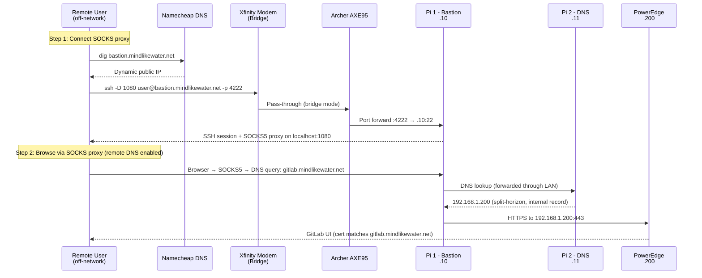
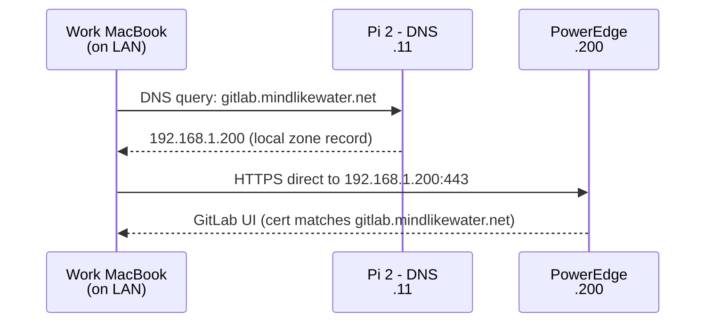
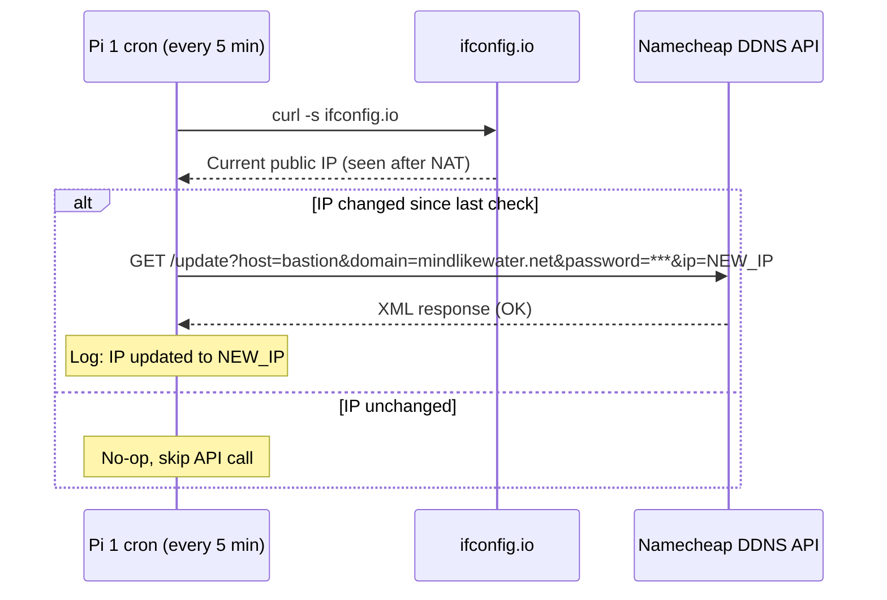
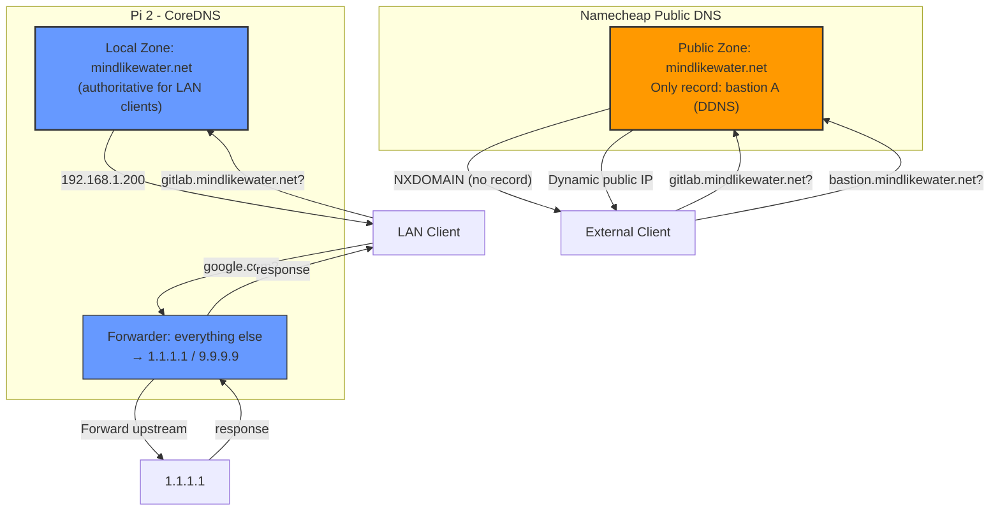
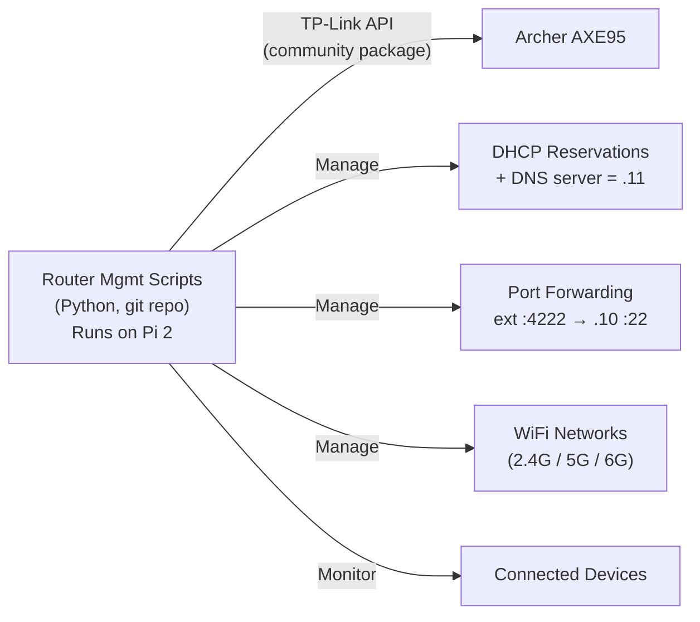
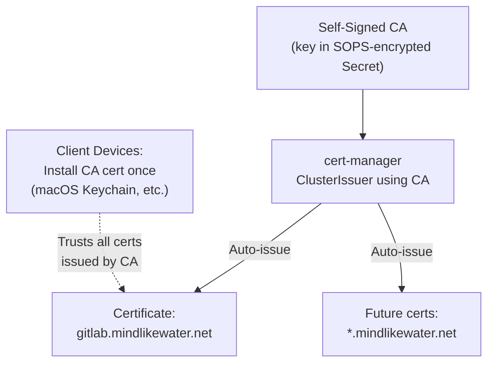
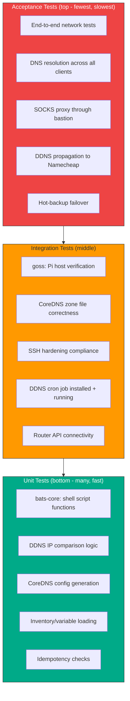
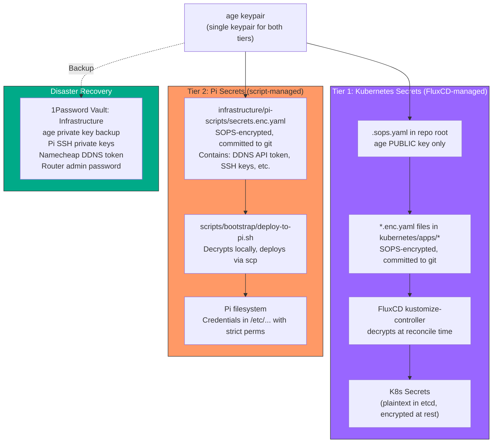

# Home Infrastructure Architecture

## Network Topology

```mermaid
graph TD
    subgraph Internet
        ISP["Internet (Xfinity Cable)"]
        NAMECHEAP["Namecheap DNS<br/>mindlikewater.net<br/>Only record: bastion A (DDNS)"]
    end

    subgraph Edge["Edge - Modem (Zero Config After Bridge Toggle)"]
        MODEM["Xfinity Modem/Gateway<br/>BRIDGE MODE<br/>Pass-through only<br/>No NAT, No DHCP, No WiFi"]
    end

    subgraph Network["Internal Network - 192.168.1.0/24"]
        ROUTER["router.mindlikewater.net<br/>Archer AXE95 / AXE7800 - 192.168.1.1<br/>PRIMARY ROUTER: NAT + Firewall + DHCP + WiFi<br/>Gets real public IP via bridge mode<br/>Port forward: ext :4222 → Pi 1 :22<br/>DHCP DNS: point clients to Pi 2 (.11)<br/>Managed via Python TP-Link API from Pi 2"]

        subgraph PiServices["Raspberry Pi Fleet (4 devices, 2 primary + 2 hot-backup)"]
            PI_BASTION["Pi 1 - BASTION + DDNS<br/>bastion.mindlikewater.net<br/>192.168.1.10<br/>───────────────<br/>SSH jump box (key-only, no passwords)<br/>DDNS cron: curl Namecheap API every 5 min<br/>Hardened: minimal Debian, unattended-upgrades<br/>No other services"]
            PI_DNS["Pi 2 - DNS + INFRA MGMT<br/>dns.mindlikewater.net<br/>192.168.1.11<br/>───────────────<br/>CoreDNS: split-horizon for mindlikewater.net<br/>Upstream: Cloudflare 1.1.1.1 / Quad9 9.9.9.9<br/>Router mgmt scripts (Python TP-Link API)<br/>Scripts sourced from git repo"]
            PI_BACKUP1["Pi 3 - HOT BACKUP (Bastion)<br/>192.168.1.12<br/>───────────────<br/>Identical config to Pi 1<br/>Standby: takes over if Pi 1 fails<br/>Synced via cron/rsync"]
            PI_BACKUP2["Pi 4 - HOT BACKUP (DNS)<br/>192.168.1.13<br/>───────────────<br/>Identical config to Pi 2<br/>Secondary DNS: clients can use as fallback<br/>Synced via cron/rsync"]
        end

        subgraph Server["Dell PowerEdge R630 - 192.168.1.200<br/>poweredge.mindlikewater.net<br/>192GB RAM / 36 cores / 3x 800GB SSD<br/>NOT ALWAYS ON (electricity cost) - K8s workloads are intermittent"]
            TALOS["Talos Linux<br/>Immutable OS<br/>API-managed via talosctl<br/>No SSH"]
            K8S["Single-Node Kubernetes<br/>k8s.mindlikewater.net<br/>allowSchedulingOnControlPlanes: true"]

            subgraph K8sWorkloads["K8s Workloads (all FluxCD-managed)"]
                FLUX["FluxCD<br/>GitOps Controller<br/>Source: Git repo<br/>SOPS decryption enabled"]
                SOPS_SECRET["SOPS + age<br/>In-cluster Secret<br/>(bootstrap: manual)"]
                CERTMGR["cert-manager<br/>Self-signed CA<br/>Auto-issues TLS certs"]
                GITLAB["GitLab Omnibus Container<br/>gitlab.mindlikewater.net<br/>(not Helm chart)<br/>Git + CI/CD + Registry"]
                AI["AI Agentic Workloads<br/>Programmatic K8s access"]
                INGRESS["Ingress Controller<br/>(Traefik or nginx)"]
                METALLB["MetalLB<br/>LB IPs: .220-.239"]
            end
        end

        subgraph Clients["Client Devices"]
            WORK_MAC["Work MacBook<br/>.2 wired / .52 wifi"]
            PERSONAL_MAC["Personal MacBook<br/>.7 wired / .57 wifi"]
            GEEKOM["GeekOM Mini PC<br/>.3 wired / .53 wifi"]
            HP["Windows HP<br/>.4 wired / .54 wifi"]
        end
    end

    ISP -->|WAN| MODEM
    MODEM -->|"Ethernet (public IP pass-through)"| ROUTER

    ROUTER -->|LAN| PI_BASTION
    ROUTER -->|LAN| PI_DNS
    ROUTER -->|LAN| PI_BACKUP1
    ROUTER -->|LAN| PI_BACKUP2
    ROUTER -->|LAN| TALOS
    ROUTER -->|LAN / WiFi| WORK_MAC
    ROUTER -->|LAN / WiFi| PERSONAL_MAC
    ROUTER -->|LAN / WiFi| GEEKOM
    ROUTER -->|LAN / WiFi| HP

    ROUTER -.->|"Port forward<br/>ext :4222 → .10 :22"| PI_BASTION

    PI_BASTION -.->|"DDNS cron<br/>curl → Namecheap API"| NAMECHEAP
    PI_DNS -.->|"Upstream DNS<br/>(non-mindlikewater.net)"| ROUTER

    TALOS --> K8S
    K8S --> FLUX
    K8S --> SOPS_SECRET
    K8S --> CERTMGR
    K8S --> GITLAB
    K8S --> AI
    K8S --> INGRESS
    K8S --> METALLB
    FLUX -->|"Reconcile from Git"| GITLAB

    ROUTER -.->|"DHCP: DNS server = .11"| PI_DNS

    style MODEM fill:#999,stroke:#333,stroke-width:1px,color:#fff
    style ROUTER fill:#0a8,stroke:#333,stroke-width:2px,color:#fff
    style PI_BASTION fill:#f96,stroke:#333,stroke-width:2px
    style PI_DNS fill:#69f,stroke:#333,stroke-width:2px
    style TALOS fill:#6c6,stroke:#333,stroke-width:2px
    style K8S fill:#6c6,stroke:#333,stroke-width:1px
    style GITLAB fill:#e44,stroke:#333,stroke-width:2px,color:#fff
    style FLUX fill:#96f,stroke:#333,stroke-width:2px,color:#fff
    style AI fill:#fc6,stroke:#333,stroke-width:2px
    style CERTMGR fill:#0aa,stroke:#333,stroke-width:1px,color:#fff
    style INGRESS fill:#888,stroke:#333,stroke-width:1px,color:#fff
    style METALLB fill:#888,stroke:#333,stroke-width:1px,color:#fff
    style SOPS_SECRET fill:#888,stroke:#333,stroke-width:1px,color:#fff
    style PI_BACKUP1 fill:#fa6,stroke:#333,stroke-width:1px
    style PI_BACKUP2 fill:#69f,stroke:#333,stroke-width:1px
```



## Remote Access Flow (SOCKS Proxy via Bastion)



## LAN Access Flow (Direct)



## DDNS Update Flow



## Split-Horizon DNS Configuration



## Router Management



## IP Address Scheme

| Range | Purpose | Hostnames |
|-------|---------|-----------|
| .1 | Router | router.mindlikewater.net |
| .2-.9 | Wired static clients | (no DNS names needed) |
| .10 | Pi 1 - Bastion + DDNS | bastion.mindlikewater.net |
| .11 | Pi 2 - DNS + Infra Mgmt | dns.mindlikewater.net |
| .12 | Pi 3 - Hot Backup (Bastion) | *(standby for Pi 1)* |
| .13 | Pi 4 - Hot Backup (DNS) | *(standby/secondary for Pi 2)* |
| .14-.19 | Future Pis | *(reserved)* |
| .50-.59 | Wireless static clients | (no DNS names needed) |
| .100-.199 | DHCP dynamic range | *(auto-assigned)* |
| .200 | PowerEdge server | poweredge.mindlikewater.net |
| .201-.219 | Future servers | *(reserved)* |
| .220-.239 | MetalLB LoadBalancer pool | *(K8s assigns from pool)* |
| .240-.254 | Reserved | *(future use)* |

## DNS Records

### Pi DNS (CoreDNS) - Local Zone: mindlikewater.net

| Hostname | IP | Purpose |
|----------|----|---------|
| router.mindlikewater.net | 192.168.1.1 | Router admin |
| bastion.mindlikewater.net | 192.168.1.10 | Pi 1 (internal access) |
| dns.mindlikewater.net | 192.168.1.11 | Pi 2 (internal access) |
| poweredge.mindlikewater.net | 192.168.1.200 | Server direct access |
| k8s.mindlikewater.net | 192.168.1.200 | K8s API endpoint |
| gitlab.mindlikewater.net | 192.168.1.200 | GitLab (LAN + SOCKS tunnel) |

### Namecheap Public DNS - mindlikewater.net

| Record | Type | Value | Notes |
|--------|------|-------|-------|
| bastion | A (DDNS) | Dynamic public IP | Updated by Pi 1 cron |

*All other hostnames intentionally absent from public DNS.*

## TLS Certificates



## Architecture Decisions (All Resolved)

| # | Decision | Choice | Rationale |
|---|----------|--------|-----------|
| 1 | Xfinity modem mode | **Bridge** | Zero config after initial toggle. Router gets real public IP. No double NAT. |
| 2 | Primary router | **Archer AXE95** | Handles NAT, DHCP, firewall, WiFi. Programmable via Python TP-Link API. |
| 3 | Pi 1 role | **Bastion + DDNS** | DDNS is a cron job (zero attack surface). Both are edge concerns. |
| 4 | Pi 2 role | **DNS + Router Mgmt** | CoreDNS for split-horizon. Router scripts for infra-as-code. |
| 5 | DDNS placement | **Internal (on Pi 1)** | Namecheap API auto-detects IP via NAT. No WAN-side placement needed. |
| 6 | Bastion placement | **Inside router (on LAN)** | Router port-forwards SSH only. SSH key auth = bastion compromise requires breaking key auth regardless of placement. |
| 7 | DNS zone | **Single: mindlikewater.net** | Split-horizon: Pi DNS authoritative internally, Namecheap externally. No separate internal zone needed. |
| 8 | External access | **SOCKS proxy via bastion** | `ssh -D 1080` + browser with remote DNS. Single hostname works LAN and remote. |
| 9 | DNS software | **CoreDNS** | Lightweight, config-as-code, K8s-native style. No unnecessary extras. |
| 10 | Router management | **Python TP-Link API on Pi 2** | AXE95 v1.0 confirmed supported. Scripts in git, runs on always-on Pi. |
| 11 | MetalLB range | **.220-.239** | 20 IPs, plenty for single-node homelab. |
| 12 | TLS certificates | **Self-signed CA + cert-manager** | Automated cert issuance. CA cert installed on client devices once. |
| 13 | SSH external port | **Non-standard (4222)** | Reduces scanner noise. Not security-through-obscurity (key auth is the real gate). |
| 14 | Secrets management | **SOPS + age** | Git-committable encryption. 1Password backup for DR. FluxCD native integration. |
| 15 | K8s repo layout | **onedr0p/cluster-template pattern** | `kubernetes/{apps,bootstrap,components,flux}` -- community standard for Talos+FluxCD homelabs. |
| 16 | Community charts | **Helm via FluxCD HelmRelease** | cert-manager, MetalLB, ingress via HelmRelease CRD. Version bumps = one-line change. |
| 17 | Pi configuration | **Ansible-compatible shell scripts** | Idempotent bash scripts structured so they can be converted to Ansible later if needed. No Ansible dependency for 4 Pis. |
| 18 | Dependency updates | **Renovate Bot from day one** | Auto-creates PRs for Helm chart, container image, and Flux component updates. |
| 19 | CNI | **Talos default + MetalLB** | Start simple. Cilium is powerful but unnecessary complexity for single-node. Can migrate later. |
| 20 | Talos config mgmt | **talhelper** | Generates Talos machine configs from simpler YAML input. Used by onedr0p template. |
| 21 | K8s availability | **Intermittent (not always on)** | PowerEdge runs only when needed (electricity cost). Pis are always-on for DNS and bastion. |
| 22 | Pi redundancy | **Hot-backup Pis (4 total)** | Pi 3 mirrors Pi 1 (bastion), Pi 4 mirrors Pi 2 (DNS). Config sync via cron/rsync. Pi 4 as secondary DNS in DHCP. |
| 23 | Infrastructure testing | **Full test pyramid** | bats-core for shell script unit tests, goss for host verification, integration tests against real Pis. |
| 24 | Pi secrets (non-K8s) | **SOPS + age (unified)** | Same tooling as K8s secrets. Pi scripts decrypt at deploy time. SSH keys and API tokens managed via SOPS. |
| 25 | Project scope | **AI-automated home network** | Not primarily K8s/GitLab. The project manages the entire home network: modem, router, Pis, DNS, bastion, server. |

## Repository Structure

```
home-tech-infrastructure/
├── _bmad/                          # BMAD framework
├── _bmad-output/                   # BMAD planning artifacts
├── reference/                      # Vendor docs
│
├── kubernetes/                     # Everything FluxCD manages
│   ├── apps/                       # Workloads
│   │   ├── gitlab/
│   │   │   ├── ks.yaml             # Flux Kustomization
│   │   │   └── app/
│   │   │       ├── deployment.yaml # GitLab Omnibus (not Helm)
│   │   │       ├── secrets.enc.yaml
│   │   │       └── kustomization.yaml
│   │   └── ai-agents/
│   │       └── ...
│   ├── bootstrap/                  # Flux bootstrap
│   │   └── kustomization.yaml
│   ├── components/                 # Reusable Kustomize components
│   └── flux/                       # Flux system config
│       └── config/
│           └── cluster.yaml
│
├── infrastructure/                 # Non-K8s infra-as-code
│   ├── pi-scripts/                 # Ansible-compatible shell scripts for Pis
│   │   ├── inventory.sh            # Pi IPs, roles, hostnames
│   │   ├── common/                 # Shared: updates, hardening, user setup
│   │   │   ├── harden.sh
│   │   │   └── unattended-upgrades.sh
│   │   ├── bastion/                # Pi 1 + Pi 3 (hot backup)
│   │   │   ├── setup-bastion.sh    # SSH hardening, key-only auth
│   │   │   └── setup-ddns.sh       # DDNS cron job
│   │   ├── dns/                    # Pi 2 + Pi 4 (hot backup)
│   │   │   ├── setup-coredns.sh    # CoreDNS install + zone config
│   │   │   └── setup-router-mgmt.sh # TP-Link API Python env
│   │   └── sync/                   # Hot-backup sync scripts
│   │       ├── sync-bastion.sh     # Pi 1 → Pi 3 config sync
│   │       └── sync-dns.sh         # Pi 2 → Pi 4 config sync
│   └── talos/
│       ├── talconfig.yaml          # talhelper config
│       └── patches/                # Talos config patches
│
├── scripts/                        # Operational helpers
│   ├── bootstrap/
│   │   ├── generate-age-keypair.sh
│   │   ├── install-ca-cert.sh
│   │   └── deploy-to-pi.sh        # Push scripts to Pis via scp + run
│   └── ddns/
│       └── update-namecheap.sh     # Deployed to Pi 1 by setup script
│
├── tests/                          # Infrastructure test suite
│   ├── unit/                       # bats-core shell script tests
│   │   ├── test_ddns_update.bats
│   │   ├── test_coredns_config.bats
│   │   └── test_inventory.bats
│   ├── integration/                # goss host verification specs
│   │   ├── bastion.yaml            # Verify Pi 1 config
│   │   ├── dns.yaml                # Verify Pi 2 config
│   │   └── common.yaml             # Verify shared config
│   └── acceptance/                 # End-to-end network tests
│       ├── test_dns_resolution.sh
│       ├── test_ddns_propagation.sh
│       └── test_socks_proxy.sh
│
├── .sops.yaml                      # SOPS config (public key only)
├── .gitignore
├── CLAUDE.md
├── Makefile                        # Developer commands
├── renovate.json                   # Dependency auto-updates
└── README.md
```

### Structure Rationale

| Directory | Pattern | Source |
|-----------|---------|--------|
| `kubernetes/` | onedr0p/cluster-template convention | Community standard for Talos+FluxCD |
| `kubernetes/apps/*/ks.yaml` + `app/` | FluxCD Kustomization per-app | onedr0p pattern for dependency ordering |
| `infrastructure/pi-scripts/` | Ansible-compatible shell scripts | Idempotent bash, structured for Ansible migration. No Ansible overhead for 4 Pis. |
| `infrastructure/talos/` | talhelper-managed configs | onedr0p template tooling |
| `scripts/` | One-off helpers and deployment scripts | Bootstrap, deploy-to-pi, operational scripts |
| `tests/` | Full test pyramid (unit/integration/acceptance) | bats-core, goss, end-to-end network tests |
| `renovate.json` | Renovate Bot config | Auto-dependency updates from day one |

### What Uses Helm (HelmRelease) vs Raw Manifests (Kustomize)

| Component | Method | Why |
|-----------|--------|-----|
| cert-manager | **HelmRelease** | Community chart, complex, version-tracked upstream |
| MetalLB | **HelmRelease** | Community chart |
| Ingress controller | **HelmRelease** | Community chart |
| GitLab Omnibus | **Raw manifests** | Simple Deployment, Chad knows Omnibus internals |
| AI workloads | **Raw manifests** | Custom, no upstream chart |
| SOPS age Secret | **Raw manifest** | Bootstrap, one-time |

## Bootstrap Order

```mermaid
flowchart TD
    B1["1. Xfinity Modem → Bridge Mode<br/>(one-time manual toggle)"]
    B2["2. Archer AXE95 Setup<br/>Static IPs, DHCP range, port forward<br/>(Python TP-Link API or initial manual)"]
    B3["3. Pi 1 - Bastion (shell scripts)<br/>Harden OS, SSH key-only<br/>DDNS cron job"]
    B4["4. Pi 2 - DNS (shell scripts)<br/>CoreDNS with mindlikewater.net zone<br/>Router mgmt scripts"]
    B4B["4b. Pi 3+4 - Hot Backups<br/>Clone config from Pi 1+2<br/>Setup sync cron jobs"]
    B5["5. Run tests<br/>bats-core unit tests on scripts<br/>goss verification on all Pis"]
    B6["6. PowerEdge - Talos Linux<br/>Boot ISO, apply machine config<br/>Verify kubectl access"]
    B7["7. FluxCD Bootstrap<br/>(from GitHub, migrate later)<br/>+ SOPS age secret (manual)"]
    B8["8. cert-manager + CA<br/>Self-signed CA, ClusterIssuer<br/>Install CA on client devices"]
    B9["9. GitLab Deployment<br/>Omnibus container via FluxCD<br/>gitlab.mindlikewater.net"]
    B10["10. AI Agentic Workloads<br/>Deploy via FluxCD"]
    B11["11. Migrate FluxCD source<br/>GitHub → self-hosted GitLab"]

    B1 --> B2 --> B3 --> B4 --> B4B --> B5 --> B6 --> B7 --> B8 --> B9 --> B10 --> B11

    style B1 fill:#999,stroke:#333,color:#fff
    style B2 fill:#0a8,stroke:#333,color:#fff
    style B3 fill:#f96,stroke:#333
    style B4 fill:#69f,stroke:#333
    style B4B fill:#fa6,stroke:#333
    style B5 fill:#0a0,stroke:#333,color:#fff
    style B6 fill:#6c6,stroke:#333
    style B7 fill:#96f,stroke:#333,color:#fff
    style B8 fill:#0aa,stroke:#333,color:#fff
    style B9 fill:#e44,stroke:#333,color:#fff
    style B10 fill:#fc6,stroke:#333
    style B11 fill:#96f,stroke:#333,color:#fff
```



## Testing Strategy (Full Pyramid)

### Test Pyramid Overview



### Unit Tests (bats-core)

**Tool**: [bats-core](https://github.com/bats-core/bats-core) (Bash Automated Testing System)

Test shell script functions in isolation. Fast, no Pi hardware needed.

| What to test | Example assertion |
|---|---|
| DDNS IP-change detection | `assert_equal "$(detect_ip_change "1.2.3.4" "1.2.3.4")" "unchanged"` |
| CoreDNS zone file generation | `assert_output --partial "bastion.mindlikewater.net"` |
| Inventory variable loading | `assert_equal "$PI1_IP" "192.168.1.10"` |
| Idempotent script re-runs | `run setup_bastion.sh && run setup_bastion.sh` -- no errors, no changes |
| Input validation | `run setup_bastion.sh --ip "not-an-ip"` -- exits non-zero |

**Conventions**:
- Tests live in `tests/unit/*.bats`
- Each Pi role script (`bastion/`, `dns/`, `common/`) has corresponding test file
- Scripts must be structured with functions (not just top-level commands) so functions are testable
- Source scripts in tests: `source infrastructure/pi-scripts/bastion/setup-ddns.sh`
- Use `bats-assert` and `bats-support` helper libraries

### Integration Tests (goss)

**Tool**: [goss](https://github.com/goss-org/goss) (Quick and easy server testing)

Verify actual Pi configuration state. Runs on the Pi (or in a container simulating it).

| What to verify | goss spec |
|---|---|
| CoreDNS binary installed | `command: coredns: exists: true` |
| CoreDNS service running | `service: coredns: running: true, enabled: true` |
| SSH password auth disabled | `file: /etc/ssh/sshd_config: contains: ["PasswordAuthentication no"]` |
| Unattended-upgrades installed | `package: unattended-upgrades: installed: true` |
| DDNS cron job present | `command: crontab -l: stdout: ["/update-namecheap.sh"]` |
| Port 22 listening (bastion) | `port: tcp:22: listening: true` |
| Port 53 listening (DNS) | `port: tcp:53: listening: true` |
| DNS resolves correctly | `command: dig @localhost gitlab.mindlikewater.net: stdout: ["192.168.1.200"]` |

**Conventions**:
- Specs live in `tests/integration/*.yaml`
- Run on Pi via `goss --gossfile tests/integration/bastion.yaml validate`
- Can also run in CI using `dgoss` (Docker wrapper) against a Debian container
- Include in `make test-integration` target

### Acceptance Tests (end-to-end)

Test the actual user experience of the network. These run from a client machine (or the CI box) against the real network.

| Scenario | How tested |
|---|---|
| Internal DNS resolution | From LAN client: `dig @192.168.1.11 gitlab.mindlikewater.net` returns `.200` |
| External DNS (public) | `dig @8.8.8.8 bastion.mindlikewater.net` returns current public IP |
| SOCKS proxy works | `ssh -D 1080 bastion && curl --socks5-hostname localhost:1080 https://gitlab.mindlikewater.net` |
| DDNS updates on IP change | Simulate IP change, wait 5 min, verify Namecheap record updated |
| Hot-backup failover | Stop CoreDNS on Pi 2, verify Pi 4 resolves queries as secondary |
| Router API reachable | `python -c "from tplinkrouterc6u import TplinkRouter; ..."` from Pi 2 |

**Conventions**:
- Tests live in `tests/acceptance/test_*.sh`
- Run with `make test-acceptance` (requires network access to real Pis)
- Should mirror what a human would do to verify the system works

### Makefile Targets

```makefile
test:              ## Run all tests
test-unit:         ## Run bats-core unit tests (no Pi needed)
test-integration:  ## Run goss specs on Pis (requires SSH access)
test-acceptance:   ## Run end-to-end network tests (requires live network)
test-ci:           ## Run unit tests only (for CI without hardware)
lint:              ## ShellCheck all shell scripts
```

## Secrets Management Strategy

### Two-Tier Approach

All secrets use **SOPS + age** encryption, with scope covering both K8s and Pi infrastructure.



### What Gets Encrypted

| Secret | Tier | Encrypted file | Used by |
|--------|------|----------------|---------|
| GitLab root password | K8s | `kubernetes/apps/gitlab/app/secrets.enc.yaml` | GitLab Omnibus container |
| GitLab runner token | K8s | `kubernetes/apps/gitlab/app/secrets.enc.yaml` | CI runners |
| Self-signed CA private key | K8s | `kubernetes/components/cert-manager/secrets.enc.yaml` | cert-manager |
| Namecheap DDNS token | Pi | `infrastructure/pi-scripts/secrets.enc.yaml` | Pi 1 DDNS cron |
| Router admin password | Pi | `infrastructure/pi-scripts/secrets.enc.yaml` | Pi 2 router mgmt scripts |
| SSH authorized keys | Pi | `infrastructure/pi-scripts/secrets.enc.yaml` | All Pis (bastion, DNS, backups) |
| age private key | N/A | **Never in git** | SOPS decrypt operations |

### Bootstrap Procedure

1. **Generate age keypair**: `age-keygen -o age.key` (outputs public + private key)
2. **Back up to 1Password**: Store private key in 1Password vault "Infrastructure"
3. **Create `.sops.yaml`**: Commit to repo with public key only
4. **Encrypt Pi secrets**: `sops --encrypt infrastructure/pi-scripts/secrets.enc.yaml`
5. **Deploy to Pis**: `scripts/bootstrap/deploy-to-pi.sh` decrypts + copies via scp
6. **Bootstrap K8s**: `kubectl create secret generic sops-age -n flux-system --from-file=age.agekey=age.key` (one manual step)
7. **Encrypt K8s secrets**: `sops --encrypt kubernetes/apps/gitlab/app/secrets.enc.yaml`
8. **Shred local key**: `shred -u age.key`

### Pi Script Decrypt Pattern

```bash
#!/usr/bin/env bash
# deploy-to-pi.sh - decrypt secrets and deploy to target Pi
# Requires: SOPS_AGE_KEY_FILE or SOPS_AGE_KEY environment variable

set -euo pipefail

SECRETS_FILE="infrastructure/pi-scripts/secrets.enc.yaml"

# Decrypt to temp, extract specific values, deploy, then shred
DDNS_TOKEN=$(sops --decrypt --extract '["ddns_token"]' "$SECRETS_FILE")
# ... scp to Pi, set perms, shred temp files
```

### Disaster Recovery

| Scenario | Recovery steps |
|----------|---------------|
| **Pi SD card failure** | Flash new SD, run `deploy-to-pi.sh` with age key from 1Password |
| **K8s cluster loss** | Rebuild Talos, bootstrap FluxCD, recreate sops-age Secret from 1Password |
| **age key compromise** | Generate new keypair, `sops --rotate` all encrypted files, update K8s Secret, redeploy to Pis |
| **1Password unavailable** | age key also exists in K8s cluster Secret; can extract with `kubectl get secret sops-age -n flux-system -o yaml` |

### .gitignore Additions (Required)

```
# Never commit unencrypted secrets or private keys
*.dec.yaml
age.key
*.agekey
```

## Hot-Backup Pi Architecture

### Failover Strategy

| Primary | Backup | Failover mechanism |
|---------|--------|-------------------|
| Pi 1 (.10) Bastion+DDNS | Pi 3 (.12) | Manual IP swap or keepalived VRRP (future) |
| Pi 2 (.11) DNS+RouterMgmt | Pi 4 (.13) | DHCP serves both .11 and .13 as DNS servers; automatic client fallback |

### Sync Strategy

- **Config sync**: Cron job (every 15 min) rsync from primary → backup
- **What syncs**: `/etc/coredns/`, `/etc/ssh/sshd_config`, cron jobs, installed packages list
- **What does NOT sync**: Runtime state, logs, temp files
- **Sync direction**: One-way (primary → backup). Backup is read-only replica.
- **DNS failover**: DHCP gives clients both Pi 2 and Pi 4 as DNS servers. If Pi 2 dies, clients auto-fallback to Pi 4.
- **Bastion failover**: Manual for now (update router port forward to .12). Keepalived/VRRP is a future option for automatic failover.
